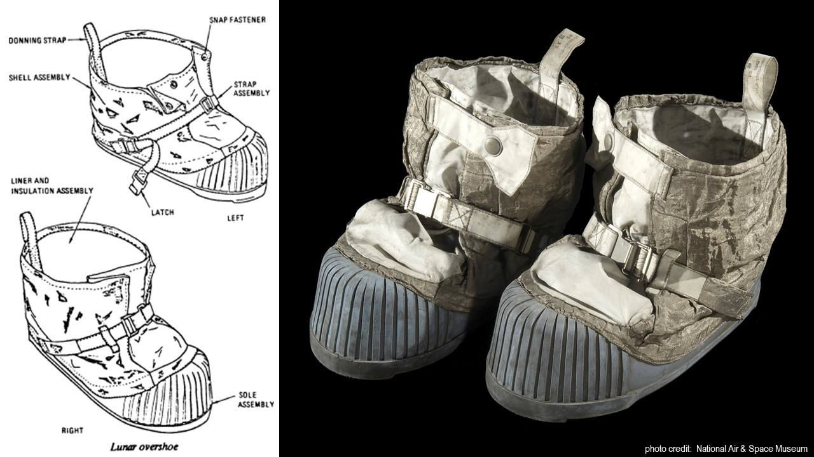
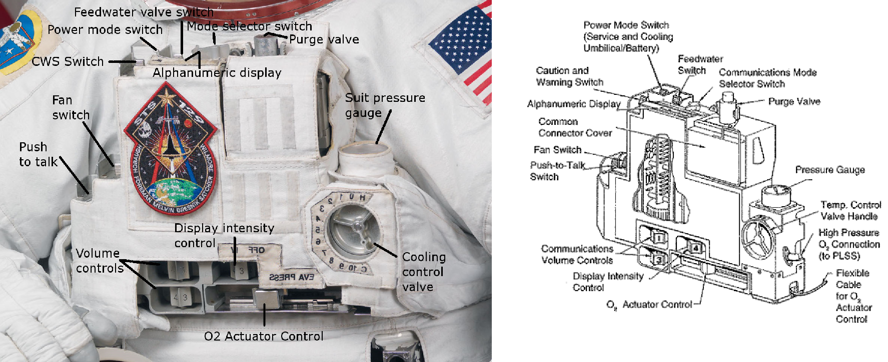
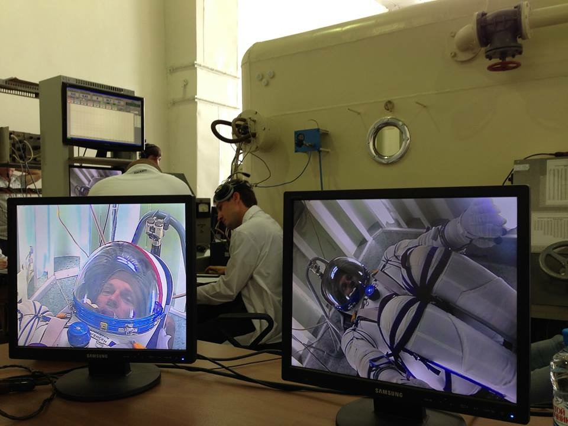
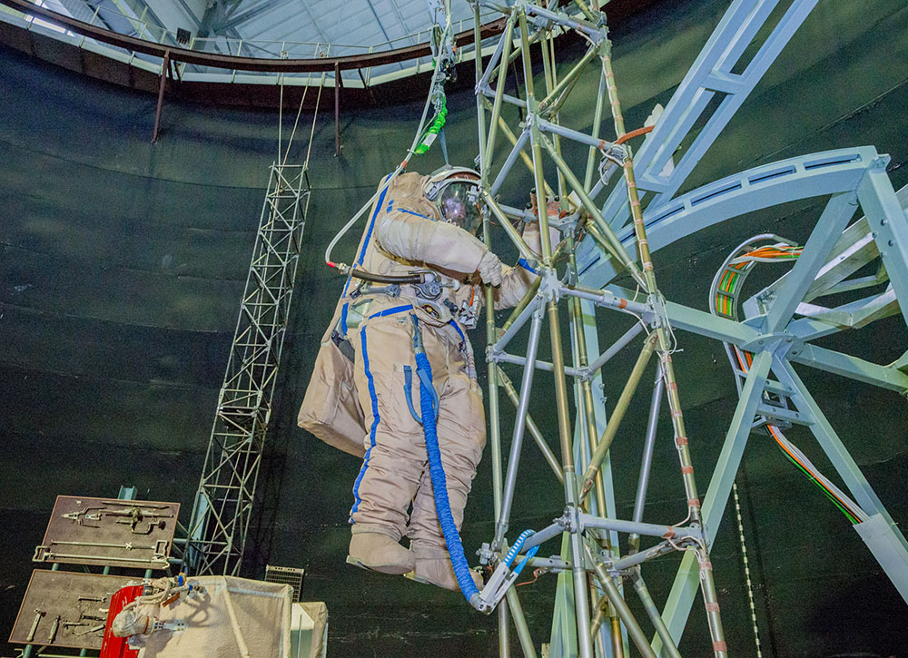

.. todo::
    - (TND-3482 Evaluation and comparison of three spacesuit assemblies) Parameters of suit :cite:`Monchaux2011`
    - weight
    - Size
    - Mobility
    - Visibility
    - Temperature
    - Cones of vision
    - Mobility and exhaustion
    - Level of bruising
    - Interface (mechanical and spatial)
    - Stowable volume

.. todo::
    - Building 7, JSC, Spacesuit lab
    - Russians wear one-piece clothes that are entered through a backpack
    - the suit is the same for both men and women
    - Women are usually weaker
    - EVA is very demanding
    - Maneuvering the suites
    - Suites were designed for great guests
    - If you are a small person, you have to turn a lot up to 120 degrees in order for the Suit to turn
    - Once (the last STS flight) there was a prototype of a small suit, but it is no longer available

.. todo::
    - tools
    - What is the impact of tool interfaces on structures
    - Optimization of station construction
    - Is it better to design differently or have a few more EVAs?
    - Costumes
    - Procedures
    - Training
    - Planning
    - Control
    - Optimization
    - Large structures, robotic arm, cables, human
    - Communication
    - Planning
    - Organization
    - Contingency EVA
    - Every crew member must be prepared to do it at any time
    - Quick EVA for emergency repair of tools and devices
    - If we fly to Mars, something will also have to be repaired on the ship during the journey, etc.
    - How to fix a broken spacesuit in space?
    - Using only tools on the ISS
    - The costumes were designed to be assembled in the laboratory by technicians and not in a 0g environment
    - Gloves chafing
    - May lead to leakage
    - The suits have a compressor that pumps a lot of air as he sees it escaping
    - They must watch out for the heads of screws, sharp handrails and edges, unsecured ends of steel cables, worn gaskets on metal elements, plugs preventing screws from unscrewing
    - The micrometeorites made small gaps and sharp edges in the station for 15 years
    - The metal handrails through the hooks they use to fasten have gotten small metal splinters that can puncture the glove
    - Micrometeorites
    - https://youtu.be/Z5Bz6L93Gwo

Outfit inside the suit
^^^^^^^^^^^^^^^^^^^^^^
.. todo::
    - Cotton Long Johns (ordinary, off-the shelf cotton underwear)
        - is to soak the sweat into it
        - so that the body is not slippery
        - so that sweat does not accumulate and fly in the suit
    - Liquid Cold Ventilation Garment
        - underwear with long sleeves and shoulder straps interspersed with tubes with flowing water
        - cold water flows in it
        - by changing the speed of the water flow, you can adjust the temperature
        - the arrangement of the tubes means that you do not feel the local cold, but it diffuses throughout the body
        - underwear has a fine mesh through which air flows
    - Cotton gloves (which go under ordinary gloves) they are supposed to soak up the sweat
    - Various pads and shields to protect against body injuries and suit prints plus tumors
    - adult diaper

Biomedical systems of the suit
^^^^^^^^^^^^^^^^^^^^^^^^^^^^^^
.. todo::
    - Astronauts during EVA on the ISS do not use radiation decimeter because they are afraid that it will be recorded and they will not play them the next time.
     - Astronauts do not always want to report everything, just in case, because they are not sure if they did everything perfectly.
     - Radiation
        - Radiation dosimeter
    - Circulatory system
        - ECG, 3 electrodes
    - Respiratory system
        - Respiratory Coefficient
        - Respiratory trace
        - Oxygen Consumption
        - Oxygen Uptake
        - CO2 sensor
        - O2 sensor
        - O2 consumption (per astronaut)
        - anaerobic (based on O2 i CO2)
        - metabolism
    - Biometrics
        - measuring chest
        - temperature sensor on ear (earlier in rectal) [Russian Suit]
    - Suit systems
        - Leak Check (every suit leaks)
        - Suit sensor
        - QRS complex
        - LCVG (Liquid Cooling and Ventilation Garment)

Helmet
^^^^^^
.. todo::
    - cameras in the helmet
    - night lighting
    - air circulation in the mask
    - Communication Cap (Snoopy Cap)
        - plugs into the port in the suit
        - allows communication with the station and with the ground
    - clothing and materials inside suppress echoes
    - the helmet does not move
    - Field of View is limited
    - Situational Awareness also is limited
    - the helmet has a built-in gold Visor (knob on the right)
    - and a visor (shield) protecting against direct sun (knob on the left)
    - the glass is made of ordinary polycarbonate lexan plastic

Torso
^^^^^
.. todo::
    - Upper Torso and Lower Torso comes in three sizes
        - Small
        - Medium
        - Large

Arms and Gloves
^^^^^^^^^^^^^^^
.. todo::
    - gloves reduced dexterity
    - shoulder checklist
    - they are customizable to some extent, they come in many different sizes
    - trade-off between dexterity and comfort
    - must be lightly to make the dexterity the greatest
    - gloves and joints are important
    - gloves define what you can do
    - everyone has their own gloves

Legs and Shoes
^^^^^^^^^^^^^^
They are one of the least used elements of space suits. At the same time, during EVA on other celestial bodies, i.e. moons, other planets or asteroids, become one of its most important parts.

    Astronaut's shoes that are part of the suit *A7L* used in the Apollo program during the EVA on the Moon. Source: NASA/JSC

Na :numref:`figure-spacesuit-a7l-boots` the so-called * Lunar Overshoe *, i.e. the part that is put on the sock, which is an integral part of the suit. With the exception of * ribbed silicone rubber sole *, the outer part of the shoe was made of metal-reinforced * Chromel R * (metal-woven fabric *) fabric. The use of such technology was to protect against abrasion. The inner part of the shoe was made of a canvas covered with a Teflon layer of fiberglass (* Teflon-coated fiber-glass *). The use of 25 overlapping layers of Kapton and glass fiber was intended to increase strength, reduce weight and provide thermal insulation. The shoes were manufactured by General Electric and ILC Industries Inc.

In the current * EMU * and * Orlan * suits, the boots are not reinforced in this way. Astronauts do not use legs during spacewalks in the construction of the ISS, and this part of the suit is less complicated.

Backpack with a life support system
^^^^^^^^^^^^^^^^^^^^^^^^^^^^^^^^^^^
.. todo::
    - Portable Life Support System

Tool holders
^^^^^^^^^^^^
.. todo::
    - Mini workstation connected directly to the Hard Upper Torso
    - tools are selected depending on the tasks that need to be performed with EVA
    - tools
        - ratchet wrench 3H drive, with a knob on the back to be able to operate in a small space, the ability to attach a cheater arm to extend the handle and double the torque (be careful not to twist the screw)
        - by turning the key, the key pushes you away, so you usually use it with one hand and hold it with the other hand to gain stability, unless they use a foot restraint to keep it from flying away
        - tools must never be left without attachment, they are attached to the Equipment Tether suit (with carabiner)
        - due to the different sizes of sockets and screws, there are also adapters that are put on the key, the adapters are also connected to the smaller Equipment Theater (socket catty) with a plug so that they do not fly off when putting on

Operating pressure
^^^^^^^^^^^^^^^^^^
.. todo::
    - 3.7 psi (Apollo),
    - 4.3 psi (EMU)
    - 5.8 psi(Orlan) of current spacesuits.
    - why lowered blood pressure? due to the weight and flammability
    - new moon and mars suits are to be 8 psi (without pre-breathing), the same level as the rover
    - pre-breathing protocols
    - 100% pure oxygen (due to the mass of nitrogen)
    - Every suit leaks
    - in EVA suits, they only breathe pure oxygen
    - tightness

Insignia and patches
^^^^^^^^^^^^^^^^^^^^
.. todo::
    - That is the EVA insignia patch.  It is the symbol used by the team responsible for the suits.  It is a space age representation of Leonardo da Vinci's Vitruvian man.  The five stars represent the five NASA programs that have utilized EVA (Extravehicular Activity).

Maintaining the readiness of the suit
-------------------------------------
.. todo::
    - are not suitable for repair in weightlessness
    - Suit "Surgery", fan, pump, water-gas separator failure
    - Day and a half procedure
    - Knots and bolts
    - Twizzers, vacuum cleaner with mash Net for suction of the screws and a towel on the other side to make sure that the screws do not fall inside
    - All things wearing gloves, all recorded on cameras and monitored from the ground by engineers, have special tools for suits that are not used anywhere, space suits work in a 100% oxygen environment

Brief characteristics of selected space suits
=============================================

Characteristics of the Sokol suit
---------------------------------

Characteristics of the Orlan MKS suit
-------------------------------------
.. todo::
    - 5.7 PSI

Characteristics of the ACES i MACES suit
----------------------------------------
.. todo:: The Advanced Crew Escape Suit (ACES) or "pumpkin suit" :cite:`AstronautTrainingJournals2005`, was a full pressure suit that began to be worn by Space Shuttle crews after STS-65, for the ascent and entry portions of flight. The suit is a direct descendant of the U.S. Air Force high-altitude pressure suits worn by the two-man crews of the SR-71 Blackbird, pilots of the U-2 and X-15, and Gemini pilot-astronauts, and the Launch Entry Suits (LES) worn by NASA astronauts starting on the STS-26 flight, the first flight after the Challenger disaster. The suit is manufactured by the David Clark Company of Worcester, Massachusetts. Cosmetically the suit is very similar to the LES. ACES was first used in 1994.

.. todo:: Underneath the suits, astronauts wear "Maximum Absorbency Garment" (MAGs) urine-containment trunks (resembling "Depends" incontinence shorts) and blue-colored thermal underwear, which has plastic tubing woven into the garments allowing for liquid cooling and ventilation, the latter being handled by a connector located on the astronaut's left waist.

.. todo:: MACES (Modified Advanced Crew Escape Suit) is a work in progress. It is a suit intended for use in Orion. Because of mass and volume constraints, NASA wanted to be able to use ACES (the suit intended for ascent and entry during Space Shuttle missions) both for ascent/entry periods of Orion missions and also for EVA (space walks). MACES, therefore, is a hybrid of the orange Space Shuttle escape suit and the white ISS EVA suit.

.. todo:: The suit has a new cooling garment and new bearings in the joints. It also uses the gloves and boots from the ISS EVA suit (EMU). It looks like it will be suitable for EVAs up to about four hours. And, since that is a much longer period that the crew have to keep the visor closed while in the vehicle, a drink bag has also been added.

.. todo:: Initially, ACES was intended to be retired after the Space Shuttle Program and be replaced by the Constellation Space Suit :cite:`STSTransitionAndRetirement`. The Orion missions are now instead planned to use a modified ACES (MACES). This suit would have increased mobility in comparison to its Space Shuttle counterpart and would use a closed-loop system to preserve resources :cite:`Zero-Gravity-Suit-Tests`. NASA is also considering using it for contingency and possibly limited capacity EVAs, such as those carried out during the Gemini program :cite:`Gohmert2013`. Simulated microgravity testing has occurred on parabolic flights and in the Neutral Buoyancy Laboratory, in order to better characterise the suit's mobility :cite:`Gohmert2013` :cite:`Zero-Gravity-Suit-Tests`.

.. todo::
    - ACES Specifications
    - Name: Advanced Crew Escape Suit (S1035) :cite:`Thomas2006`
    - Derived from: USAF Model S1034 :cite:`Thomas2006`
    - Manufacturer: David Clark Company :cite:`Thomas2006`
    - Missions: STS-64 to STS-135
    - Function: Intra-vehicular activity (IVA) :cite:`Thomas2006`
    - Pressure Type: Full :cite:`Thomas2006`, :cite:`Barry1995`
    - Operating Pressure: 3.5 psi (24.1 kPa) :cite:`Thomas2006`
    - Suit Weight: 28 lb (12.7 kg) :cite:`Thomas2006`
    - Parachute and Survival Systems Weight: 64 lb (29 kg) :cite:`Thomas2006`
    - Total Weight: 92 lb (41.7 kg) :cite:`Thomas2006`
    - Useful Altitude: 30 km (100,000 ft):cite:`Coldiron2005`
    - Primary Life Support: Vehicle Provided :cite:`Thomas2006`
    - Backup Life Support: 10 minutes :cite:`Thomas2006`

Characteristics of the EMU suit
-------------------------------
.. todo::
    - total suit weighs about 275 lbs
    - 4.3 PSI
    - Extravehicular Mobility Unit
    - design from Apollo age
    - The costume consists of various materials and composite layers, a NASA mystery
    - Dressing up the suit
        - Lower Torso Assembly - trousers
        - Upper Torso Assembly - up
        - Hard upper torso - rigid shell due to the need to support tools, Life Support Systems
        - they put on pants and then put on the top
        - have a metal hoop with hooks that holds both parts together
        - later they put on gloves
        - helmet
    - SAFER

    *EMU DCM - Display and Control Module*. Source: NASA/JSC

Emergency systems of EVA suit
=============================
.. todo::
    - In the case of the emergency, people are dropping experiments and focusing on helping and returning to base.
    - The EMU holds pressure for 22 minutes

Emergency oxygen tank
---------------------

Local Tether
------------

Safety Tether
-------------
26 meters

SAFER
-----
.. todo::
    - enough at once
    - stop tumbling first
    - then aim at the ISS
    - fire up
    - they practice 20-30 times (also at night) before the exam
    - they only practice it in VRLab
    - Augmented Reality and the ability to remotely update procedures

Computer and virtual reality simulations
========================================
Due to the cost, complexity and time-consuming nature of operations in a neutral buoyancy pool, astronauts first undergo familiarization training in a Virtual Reality Lab (VR) using computer simulations such as Oculus Rift or HoloLens by Microsoft. In applications specially written for this purpose, they have the opportunity to practice maneuvers, get to know the segment of the station the work concerns or practice the ability to navigate and find outside the International Space Station.

Augmentation
-----------
.. todo::
    - mobiPV
    - Google Glass
    - Astronaut positioning and real time observation wherever they are
        - GPS on Moon and Marsie
        - Alternate navigation
        - Geography of the area
        - Slope of the terrain and hints as to whether it is safe to descend

EVA simulation in a pool of neutral buoyancy
============================================
.. todo::
    - They exercise 20 times before doing it in space
        - Entrances duration for 6 hours
        - Later in space 8/9 hours
        - Hadfield spent 240h ahead of Canada Arm 2's EVA
        - have a mission to complete
        - Generic Training, and then Flight Assignment, Repetition mode right before the departure.
        - generic training - generic training in skills that are always useful
        - cross-training trains people so that everyone has at least an idea of how it's done
        - ISS repair training
    - Communication
        - Contact with CAPCOM is also trained in the swimming pool
        - They report everything to CAPCOM
        - Comm-check first thing after getting under the water
    - Use of tools
        - Use of tools
        - thermal expansion of metals and change of force on knobs and levers
        - if you are in foot restraint, you should stop applying force to anything in order not to break
    - Familiarisation with the suit
        - checking if Portable Life System is turned on
        - Equalizing pressure inside the suit
        - EVA training in grip, double safety and load carrying
        - Pressure suit test
        - descending into the pool down the rope so that the Astronaut can react to pressure changes at his own tempo and that nothing happens
        - Ear pressure purge device (Valsalva maneuver - ear purge when pressure clogs) Dolly Burton (pressure purge mouthpiece)
        - They sit under water after 6 hours and it is very exhausting for their hands
        - Why are space suits still bulky? While it's technically possible to create a tight suit that protects you from the vacuum of space and probably the extreme temperatures as well, one of the functions of the suit is to protect you from meteoroids -- grains of sand moving at tens of thousands of miles per hour. For this reason, the suit is made up of many layers of different fabrics that will stop a meteoroid from puncturing the suit -- and the astronaut. As you can see in this diagram, layers 6 through 14, 9 layers in total, are devoted to stopping meteoroids.
    - Pool-specific procedures
        - weight out - divers balance the astronaut - they add foam and weights to keep you neutral in every position: vertically, upside down, sideways
        - they play music (Bastille - Pompeii)
    - Guard
        - 2 safety divers
        - 1 floating diver (with camera)
        - 2 utility diver with tools, monitor and help set up
        - NBL: two divers (EV1, EV2) for one astronaut, Safety Diver + one Float Diver with a camera, and they change every two hours, the video is for presentation and training analysis
        - For two people who train EVA, there are about 40 people who make sure everything is safe

Thermal and pressure chambers
==============================
Suits test in pressure chambers

(ang. *vacuum chamber*)

    ESA astronaut Andreas Mogensen during his suit tests in a pressurized chamber in Star Town. Source: ESA/EAC

Training using suspended systems
================================

    Suspended system used for astronaut training at the Cosmonaut Preparation Center in Star Town, Russia. Source: NASA/JSC

Communication and division of roles during the simulation and exit into outer space
===================================================================================

Roles and responsibilities of astronauts
----------------------------------------
.. todo::
    - At least two people go to EVA and at least one stays in the base as IVA.
    - EV1 is more prestigious. Astronauts are competing for it.
    - EV1 is awarded based on ranking or training.
    - communication relay protocol
    - common language
    - common alphabet

Roles and responsibilities of mission controllers
-------------------------------------------------

Communication characteristics
-----------------------------
.. todo::
    - During EVA, you have a big loop and everyone can listen and join the conversations.
    - Ground Loop
    - Space to Ground Loop
    - EV Loop (for EVA)
    - Russian CapCom talks to the Russian CAPCOM
    - what is the language of the conversation?
    - The American CapCom is talking to the American
    - CapCom is an astronaut and is going through the same training. These people know each other well.
    - Usually during EVA CapCom communicates with the team.

Procedure for conducting a spacewalk
====================================

Preparation for going into outer space
--------------------------------------
.. todo::
    1. airlock pressure reduction to 5 psi
        - check safety tether
    2. communication check and suit leak checks
    3. lowering the pressure to 0
    4. final suit leak check
    5. switching the suits to internal power (DCM power switch to internal)
        - check DCM power monitor
        - UAA (?) power to off
        - LEDs check to be power off
        - SC disconnect from DCM
        - on the crew lock pressure control valve is locked
        - DCM temperature control valve max heat
        - switch water on
        - DCM check blank and bite (byte) off
        - temperature control valve as desired
        - suit pressure gauge (psi 4.3 for EV1 and EV2)
        - check your visor as desired
        - read the configuration for the safety tether (open, close, lock, unlocked)
        - EV1 checks EV2, EV2 checks EV1
    6. going out into outer space (egress)
        - buddy checks
        - HAPs - helmet absorption pads checks (wthey choke the water in the event of a leak, introduced after the Luca Parmitano incident)

    - during the walk, Ground IV periodically provides information about 'cautions' and 'warnings', i.e. information about dangers that may be near the EV
        - sharp edges
        - live equipment
        - information what not to touch
        - information on what not to connect to
    - Ground IV informs about the next steps for EV1 and EV2
    - portable foot restraint installation, before proceeding with further steps such as unscrewing
    - Spacewalker Communicator - Ground IV - (flight choreographer) a person at MCC who makes sure that the eva is going according to plan and that everything is ok (during the first EVA in 2017 it was Luca Parmitano)
    - Ingress i Regress
    - What medical examination you perform before and after EVA
    - Ruskie MO - medical assessment (5 or 6)
    - treadmill, hand ergometer,
    - ECG, cardiovascular, blood pressure, QRS complex
    - it happened once that someone was disfellowshipped
    - they test the EVA ability even a few days before
    - What is the procedure for EVA preparation (oxygen intake) - pre-breath protocol
        - O2 environment makes pre-breath easier
        - The Russian suit allows you to go out faster, but not sit for so long
        - Once upon a time, they breathe pure O2 while riding a masked bike, and then they get into their suit and release the pressure
        - camp-out, they sleep in airlock with 10.2 PSI and that changes from 21% to 28% oxygen
        - exercise protocol in the suit, connection of elders
        - you can do the whole pre-breath for 4 hours in a suit (they did it twice, emergency)
        - Russians have 30-40 minutes
        - if you had an 8 PSI suit you don't need to have any pre-breath, but you wouldn't be able to do anything

Output and sample tasks
-----------------------
.. todo:: learning to open airlock
.. todo:: airlock emergency systems
.. todo:: checking the hatch
    - nominal procedures
    - repress takes 15 minutes
    - depress takes 30 minutes
    - cooling, oxygen supplies
    - Americans have caught a tool twice
    - they equalize to 5 PSI and do a leak check, if not working, they bleed the air and again

Post-return procedures
----------------------
.. todo::
    - The Russians drink vodka, still in the airlock, before the pressure equalizes. Nothing ever happened
    - Americans have caught a tool twice
    - they equalize to 5 PSI and leak check, if not working, they bleed the air and again

.. todo:: checking the hatch
    - nominal procedures
    - repress takes 15 minutes
    - depress takes 30 minutes
    - cooling, oxygen supplies

EVA on the surface of other celestial bodies
============================================
.. todo::
    - temperature
    - falling down and getting up
    - handling dust
    - photography
    - Astronaut positioning and real time observation where they are
        - GPS on the Moon and Mars
        - Alternate navigation
        - Geography of the area
    - Tools
        - spectrometers
        - portable X-ray fluorescence analyzers
        - SCIO
        - Magnetotelluric analysis
        - Terrameter LS
        - Stratagem
        - Seismic discovery

EVA on the lunar surface
------------------------
.. todo::
    - 3 ways of scrubbing CO2
    - Lithium-hydroxide
    - EMU has replaceable cartridges
    - EMU has metal-oxide in replaceable cartridges
    - swing-bads - molecular sieves (mass number of the element from the) the sieve works by sucking gas with a specific atomic mass into space
    - All systems must be at least triple

EVA on the surface of the planets
---------------------------------

EVA on the surface of asteroids and low gravity moons
-----------------------------------------------------
Currently, NASA is conducting research on the execution of EVA on the surface of asteroids and moons with low gravitational pull. The two main targets where such procedures would apply are the celestial bodies under the canceled * Asteroid Redirect Mission * program and the surface of Deimos and Phobos, the moons of the planet Mars.

Landing on the surface of natural Mars satellites has the advantages of extremely low gravity. Astronauts, after one year of flying from Earth, could test the systems and procedures on these small celestial bodies, and one concept is to build a settlement at this point in the first place before landing on the "red planet". Due to the very low gravitational pull.

NASA is currently evaluating harpoon systems and nets on which astronauts could navigate, due to the fact that a stronger jump can "launch" an astronaut for several dozen minutes into space before it subsides and can continue to move.

Use of vehicles
===============
.. todo::
    - rovers
        - manned rovers
        - autonomous rovers
        - remote controlled rovers
        - Astronaut Personal Carriers
    - heavy duty and drilling
        - telescopic reconnaissance
        - watchtower
    - Drones (jet / blades)
        - jet drones
        - Submarines
        - Balloons
        - Moles
        - Hovercraft
    - Emergency
        - In field battery fix
        - Gripper or drill stuck
        - in-blind rover control

Emergency situations during spacewalks
======================================

Suit emergency systems
----------------------
.. todo::
    - SAFER
    - holding pressure for 22 min

Security procedures
-------------------
.. todo::
    - contamination of the suit during EVA
        - airlock procedures
        - return procedures so as not to risk the lives of others
        - ammonia brush
        - evaporation of snowflakes in the sun
        - equalizing the pressure in the airlock to be able to open and throw in wet towels to wipe them off and wipe walls and vents
    - Ammonia (NH3) Leak
    - Practicing to pull someone who is having trouble during EVA.
    - When they can't see through the visor.
    - When a team member is immobilized.
    - When he passes out.
    - When there are slight problems with the suit.
    - When there are heavy problems with the suit.
    - Air access via a cable (umbilical connection).
    - They have two radios in each suite. When one stops working, they have to change the frequency.
    - They use the language of signs and gestures when they cannot communicate.
    - They listen on two frequencies.
    - Relay-com exercise, i.e. relaying messages through an intermediary when there is no direct communication with the EVA member
    - TDRS - Space to Space communication system, predefined 8 milliseconds slots (Tracking and Data Relay Satellite System)
    - Train abnormal situations w NBL
    - Emergency: One astronaut runs out of air during the EVA
    - Emergency: Water appears in the suit
    - Emergency: Cooling
    - Emergency: Habitat evacuation
    - Emergency: Towing an unconscious astronaut
    - Emergency: Communication in the event of a communication failure during EVA
    - Abort case

Sample tasks performed during spacewalks
========================================

Moving on the lunar surface during the Apollo EVA
-------------------------------------------------

Deconstruction of cameras and a photo camera during the Apollo missions
-----------------------------------------------------------------------

Demonstration of navigating in outer space in the Woschod and Gemini programs
-----------------------------------------------------------------------------

Installation of ISS systems
---------------------------

Maintenance and repair of systems on the ISS
--------------------------------------------
