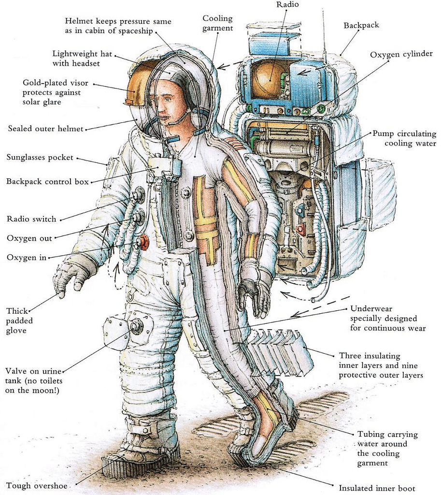

Zaznajomienie się ze skafandrem
===============================
Szkolenie przygotowujące do spacerów kosmicznych zaczyna się od zapoznania ze skafandrem. Astronauci są następnie przygotowywani do egzaminów z wykorzystania strojów *EMU* oraz *Orlan*. Ze względu na różnice w budowie, zakładaniu i zdejmowaniu skafandra, ciśnieniu operacyjnym oraz systemach awaryjnych astronauci muszą przejść ścieżkę certyfikacyjną z każdego stroju na międzynarodowej stacji kosmicznej. Po takiej certyfikacji astronauta powinien wykazać się dużą wiedzą na temat nie tylko posługiwania się wysoko wyspecjalizowanym ubiorem ale również w jego systemach awaryjnych. Każde ze szkoleń jest oceniane przez instruktorów z centrum kontroli misji.

Po pozytywnym zaliczeniu egzaminów teoretycznych z przedmiotu zaznajomienia się ze skafandrem (ang. *Suit Familiarization*) astronauta jest dopuszczony do możliwości wykorzystania stroju w symulacjach w basenie neutralnej pływalności.

    Warstwy skafandra na przykładzie amerykańskiego *A7L*. Źródło: NASA/JSC
