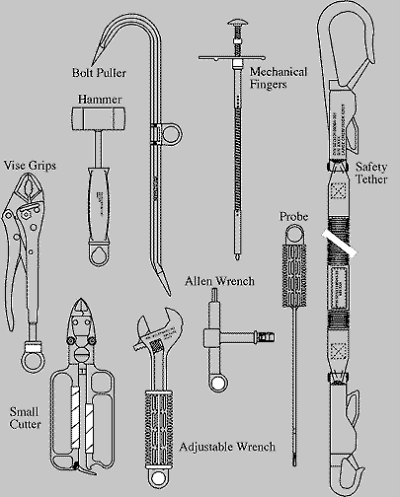

Wykorzystywanie specjalistycznych narzędzi do pracy
---------------------------------------------------
Prace w przestrzeni kosmicznej wymagają znajomości wysokospecjalistycznych narzędzi. Ich rolą jest nie tylko pomoc astronaucie w dokonaniu naprawy czy montażu sprzętu ale również zachowanie pozycji czy bezpiecznego poruszania się w obrębie stacji kosmicznej.

    Narzędzia wykorzystywane podczas EVA. Źródło: NASA/JSC

Urządzenia wykorzystywane w pracy w przestrzeni kosmicznej możemy podzielić na:

- śrubokręty (ang. hex screwdriver),
- klucze dynamometryczne (ang. ratchet wrench),
- wiertarki i wkrętarki (ang. pistol grip tool),
- urządzenia do spawania.

Prowadzenie prac w środowisku mikrograwitacji przy wykorzystaniu urządzeń tj. śrubokręty, wiertarki i wkrętarki nie jest analogiczne do wykonywania tych czynności na Ziemi. Brak oporu ośrodka i mikrograwitacja powoduje wytworzenie niezbilansowanego momentu skręcającego działającego na astronautę a to w konsekwencji prowadzi do zmiany jego pozycji względem stacji przy korzystaniu z narzędzia. Astronauta używając klucza czy wkrętarki musi być przymocowany aby móc przyłożyć odpowiednią siłę.
