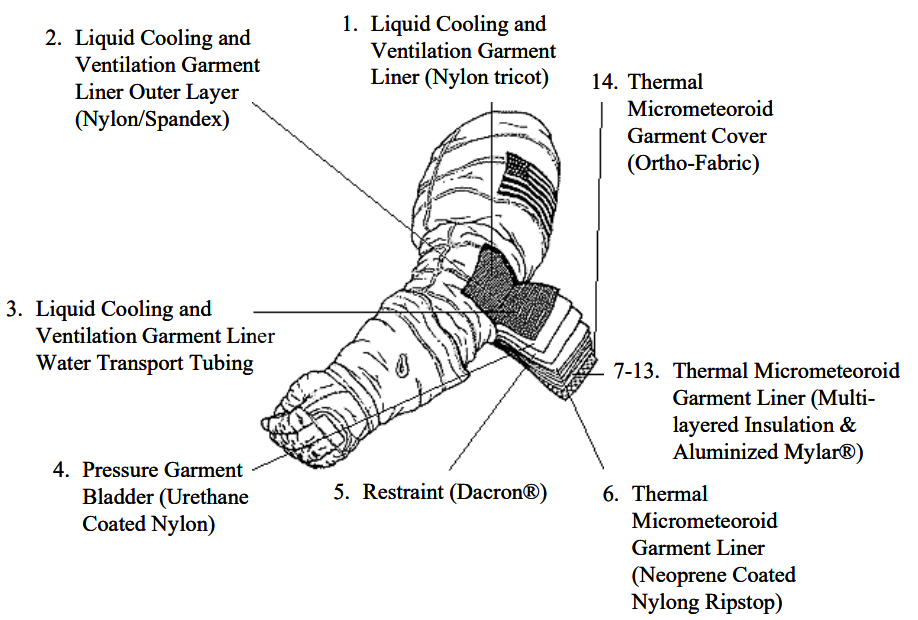

Generalna charakterystyka skafandrów kosmicznych
------------------------------------------------
Większość skafandrów działa w podobny sposób i składa się z 4 podstawowych warstw:

- warstwa pęcherza (ang. *bladder*)
- warstwa nadająca kształt (ang. *restraint*),
- warstwa ochronna (ang. *Thermal Micrometeoroid Garment*),
- warstwa zewnętrzna.

    Warstwy skafandra na przykładzie amerykańskiego *EMU*. Źródło: NASA/JSC

W zależności od skafandra inny jest sposób jego przywdziewania (ang. *donning*) i zdejmowania (ang. *doffing*). Rosyjskie skafandry *Orlan* oraz Chiński *Feitian* zakłada się wchodząc przez wejście na plecach w otwieranym plecaku *PLSS*.

Amerykańskie *EMU* przywdziewa się składając z kilku części, tj.:

- tors,
- chełm,
- rękawice,
- spodnie z butami.

Niezależnie od rozwiązania warstwa *LCVG*, która pozwala na regulowanie temperatury jest zakładana przez astronautę przed ubraniem skafandra EVA.
