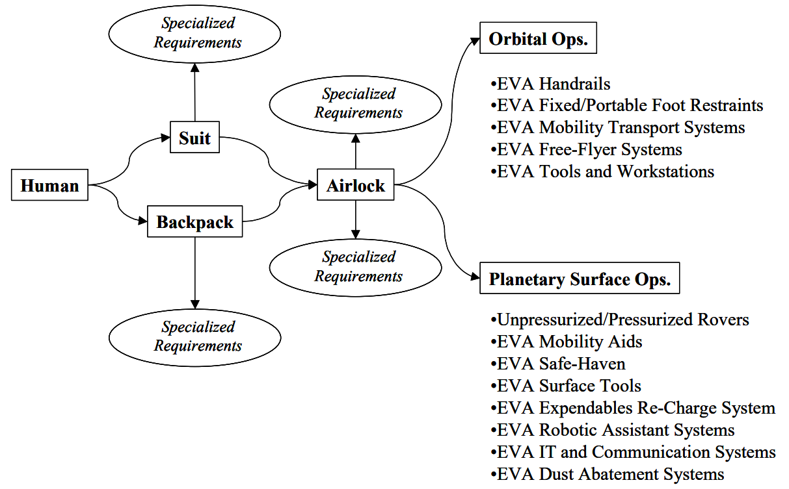

*************
Szkolenie EVA
*************

Jednym z najtrudniejszych elementów aktywności astronautów w przestrzeni kosmicznej jest wyjście na tzw. spacer kosmiczny (ang. *EVA - Extravehicular Activity*). Do przeprowadzenia takiego wyjścia astronauci przygotowują się przez dwa lata przed misją. Każdy trening jest oceniany przez zespół wykwalifikowanych i certyfikowanych instruktorów. Jednorazowe wejście do basenu neutralnej pływalności tj. NBL oraz Hydro Lab w celu ćwiczenia spacerów kosmicznych trwa sześć godzin. W trakcie astronauta wykonuje zadania pod wodą będąc umieszczonym w skafandrze EMU lub Orlan. Każdy późniejszy EVA w przestrzeni kosmicznej jest poprzedzony przynajmniej dwudziestokrotnym treningiem w środowisku symulującym stan nieważkości. W tym celu w basenie przy użyciu ciężarów i wyporników nadaje się skafandrowi kosmicznemu cechę neutralnego unoszenia się.

Ze względu na bardzo szeroki zakres obowiązków podczas spacerów kosmicznych astronauci specjalizują się w swojej dziedzinie i charakterze przeprowadzanej operacji. Każdy z nich także otrzymuje szkolenie umożliwiające mu zastąpienie dowolnego innego astronauty w jego obowiązkach gdyby zaszła taka potrzeba. Z tego względu szkolenie astronautów podzielone jest na dwa typy:

- szkolenie ogólne (ang. *generic training*),
- szkolenie przekrojowe (ang. *cross training*).

Ponadto wyjścia w przestrzeń kosmiczną dzieli się na:

- zaplanowane,
- awaryjne,
- na obcych ciałach niebieskich.

Astronauci podczas szkolenia podstawowego, a później dla utrzymania sprawności w trakcie swojej kariery ćwiczą wyjścia EVA w basenie neutralnej pływalności. Podczas tych zajęć szkolą się z rozwiązywania sytuacji awaryjnych, m.in. ewakuacja astronauty, który ma niesprawny kombinezon lub nie może się poruszać.

Spacery kosmiczne wymagają wysokiej sprawności oraz dużej siły fizycznej. Z tego względu nie wszyscy astronauci mają możliwość wykorzystania w kosmosie wyuczonych uprzednio umiejętności. Aby astronauta mógł wyjść w przestrzeń kosmiczną musi udowodnić znajomość stroju przechodząc stosowny egzamin jak również musi posiadać odpowiednią kondycję i formę.

Na chwilę obecną wyjścia w przestrzeń kosmiczną skupiają się głównie na pracach na orbicie przy konstrukcji i naprawy międzynarodowej stacji kosmicznej. Przed erą ISS astronauci wychodzili w celu prowadzenia prac technicznych w ramach programów MIR, Skylab, podczas programu Apollo aby dokonać demontażu kamery oraz w programie STS, Gemini i Wostok. Dotychczas EVA na innych ciałach niebieskich doświadczyło dwanaście osób.

    Podział systemów oraz infrastruktury EVA. Źródło: NASA/JSC

.. toctree::

    skafandry-podzial.rst
    skafandry-iva.rst
    skafandry-eva.rst

    eva-familiarization.rst
    eva-podzial.rst
    eva-szczelnosc.rst
    eva-sensory.rst
    eva-narzedzia.rst
    eva-support.rst
