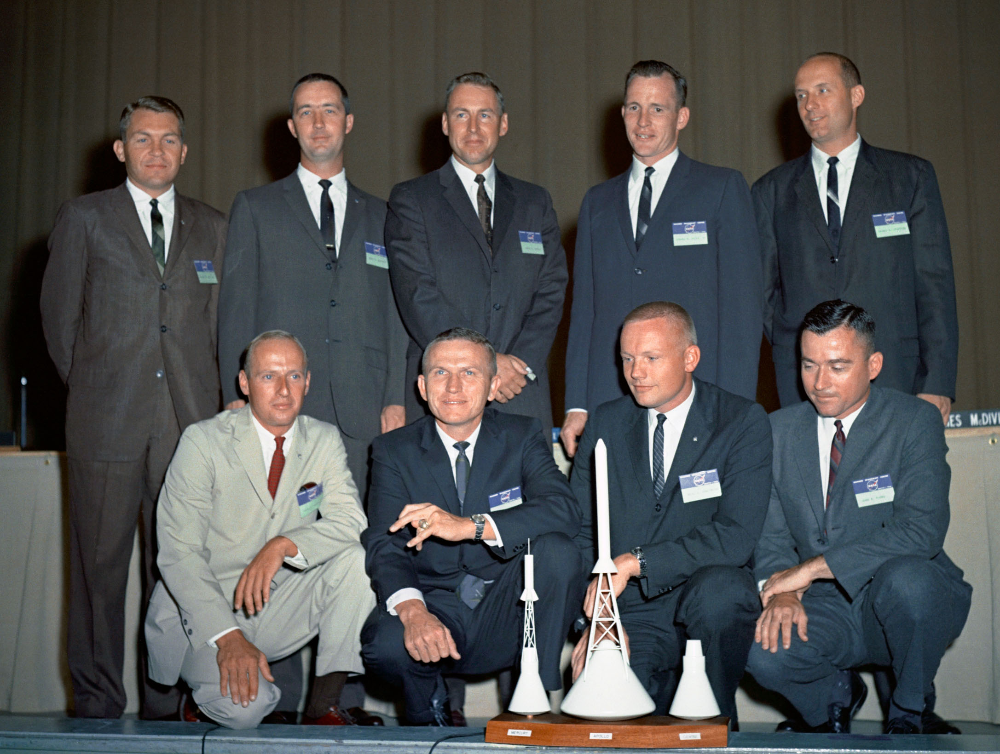
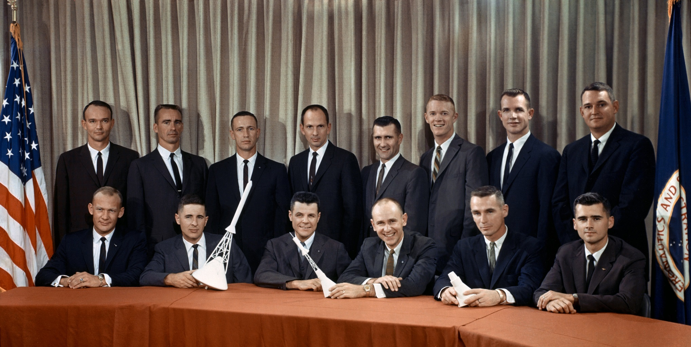

Gemini Program
==============

To meet the requirements set by President J. F. Kennedy for sending man to the moon, it was necessary to establish a bridge program between Mercury and Apollo. The aim of the program was to create and test a technology enabling the implementation of lunar flight, i.e .:

- demonstration of the endurance of man and equipment in space flights lasting from 8 to 14 days,
- * Rendezvous and docking * of two spacecraft and maneuvering the combined unit in orbit using the propulsion system of the docked vehicle,
- demonstration of space walks (* EVA - Extra-Vehicular Activity *) outside the vehicle along with the possibility of an astronaut performing operations in a pressurized suit :cite:`Granath2015`,
- Improving the * re-entry * procedure and precision landing at a specific location :cite:`Kranz2001`.

The American space agency NASA conducted two recruitment for astronauts during the Gemini project(:numref:`figure-selection-gemini-1`, :numref:`figure-selection-gemini-2`).

In preparation for the Gemini 12 mission, American astronaut Buzz Aldrin was the first to use diving techniques to simulate spacewalks, which initiated research and the creation of Neutral Buoyancy Laboratory (NBL) centers.

.. csv-table:: Gemini program astronauts :cite:`Slayton1994`
    :name: table-selection-gemini
    :file: data/selection-gemini.csv
    :header-rows: 1

    Astronauts of the first recruitment to the Gemini program. Rear row, left to right: See, McDivitt, Lovell, White, Stafford. Front Row: Conrad, Borman, Armstrong, Young. Source: NASA / JSC

    Astronauts of the second recruitment to the Gemini program. Back row, from left to right: Collins, Cunningham, Eisele, Freeman, Gordon, Schweickart, Scott, Williams. Front row: Aldrin, Anders, Bassett, Bean, Cernan, Chaffee. Source: NASA / JSC
