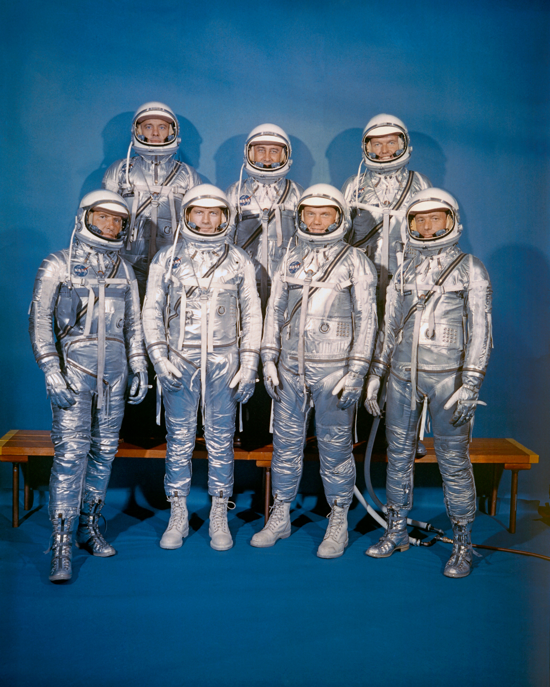
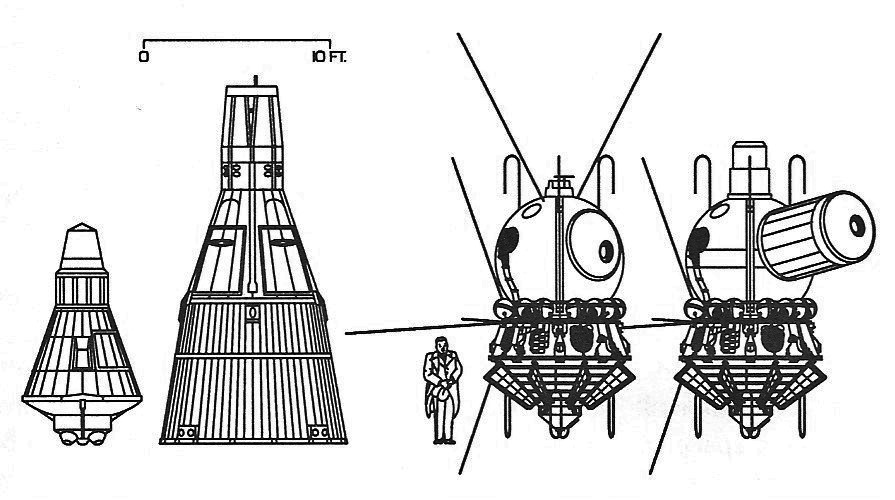

Mercury Program
===============

The main goal of the Mercury project from 1958 to 1963 was to take the first US citizen into space. This program used technology developed by the US Army, i.e. Redstone rockets, and later Atlas LV-3B intercontinental rockets developed for the US Air Force. :cite:`Swenson1966`, :cite:`Madrigal2013`, :cite:`Wolfe1979`.

The Mercury program was to dispatch the animal before the first human flight. Due to the 98.4% similarity of chimpanzee and human DNA, this primate species was selected. The chimpanzee's name was HAM which stands for Holloman Aerospace Medical Center, located at Holloman Air Force Base in New Mexico, USA. :cite:`Swenson1966`, :cite:`Human-Origins-Genetic-Evidence`.

On April 9, 1959, NASA presented the first group of astronauts, so-called "Mercury 7" (:numref:`figure-selection-mercury`). The names of the astronauts, their call sign and the date of launch are presented in the table :numref:`table-mercury-astronauts`:

For health reasons, Deke Slayton was disqualified from participating in the Mercury Program and grounded. For thirteen years since Shepard's first flight, Deke Slayton led the * Astronauts Office *, which was later renamed * Flight Crew Operations Office *. After passing medical research, Slayton took part in the last flight of the Apollo program, ie Apollo-Soyuz. This flight involved the historic docking of the Apollo and Soyuz ships in orbit and a symbolic handshake of representatives of the USA and the USSR :cite:`Grimwood2014`, :cite:`Swenson1966`.

.. csv-table:: Mercury astronauts with flight time and capsule call sign :cite:`Slayton1994`
    :name: table-mercury-astronauts
    :file: data/selection-mercury.csv
    :header-rows: 1

    Mercury astronauts, the so-called "Original Seven". First row, left to right: Walter M. Schirra, Jr., Donald K. "Deke" Slayton, John H. Glenn, Jr., and M. Scott Carpenter; back row, Alan B. Shepard, Jr., Virgil I. "Gus" Grissom, L. Gordon Cooper, Jr. source: NASA :cite:`Mercury7`.

    Comparative diagram of Mercury, Gemini, Vostok and Woschod ships. Source: Wikipedia
