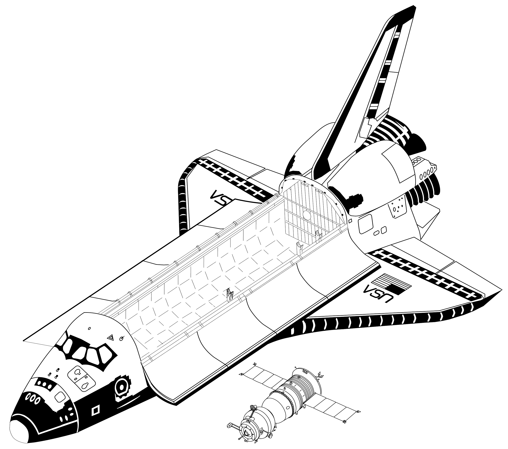

Space Transportation System Program
===================================

One of the most iconic space programs is the Space Transportation System. * Space Shuttle *. During the program, a reusable spacecraft resembling an airplane was created. The orbiter was able to orbit 27.5 metric tons of payload and a crew up to 8 people (mission STS-61A).

The following orbiters were created during the Space Shuttle program :cite:`NASASpaceShuttle`:

- Enterprise (1976) used for approach and landing tests, never reached orbit.
- Columbia (1981), the first shuttle to reach Earth orbit, was destroyed in 2003 when entering the atmosphere, the entire crew of seven people was killed,
- Challenger (1983), the second shuttle that reached orbit was destroyed in 1986 on launch, the entire crew of seven people was killed, replaced by the Endeavor shuttle,
- Discovery (1984), third orbiter, 27 years of service, 39 flights,
- Atlantis (1985), 4th orbiter, 33 missions, 4,848 orbits, 203 million km,
- Endeavor (1992), last orbiter, 25 missions, 4671 orbits, 198 million km.

The Space Shuttle program made it possible to increase the frequency of manned flights to low Earth orbit. Thanks to space shuttles and STS missions, the United States has achieved a very high level of operational efficiency and a huge advantage in the number of trained astronauts and people who have flown into space. The shuttles also contributed to the construction of the International Space Station and the launch and subsequent servicing of the Hubble telescope.

During the space shuttle flights, the US agency NASA developed an astronaut training program, which has become the basis of today's training. An EMU suit was also created - Extravehicular Mobility Unit. This suit was a modification of the * A7L * suit used in the Apollo program. The EMU is used in space missions and in the International Space Station program.

    The figure shows the scale of the American space program Space Shuttle and the Russian Soyuz TMA :cite:`Portree1995`
