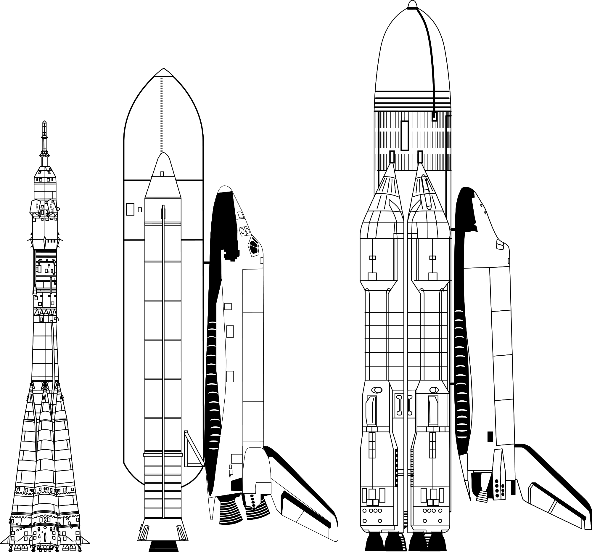

Buran program
=============

The Buran program was a response to the American Space Shuttle program. The vehicle that was created was visually similar, but significantly different and exceeded the performance of the STS shuttles. As part of the program, the Energia rocket was also created, which used modified RD-170 engines from the lunar program. Buran made one test flight on November 15, 1988 without a crew. During the flight, he made two orbits of the Earth and made an autonomous landing on the * Site 251 * - Yubileyniy Airfield runway, achieving a landing precision of 10 m in the runway axis.

Due to geopolitical reasons, the program was closed, and the orbiters were subsequently sent to the hangar at the Baikonur cosmodrome and to the museum of technology in the German city of Speyer. In May 2002, due to the roof loads caused by a severe storm, the roof of the hangar where Buran and the Energia rocket was staying, collapsed destroying the shuttle and the host.

    Comparison of the Soyuz, Space Shuttle and Energia-Buran rockets. Source: Wikipedia
