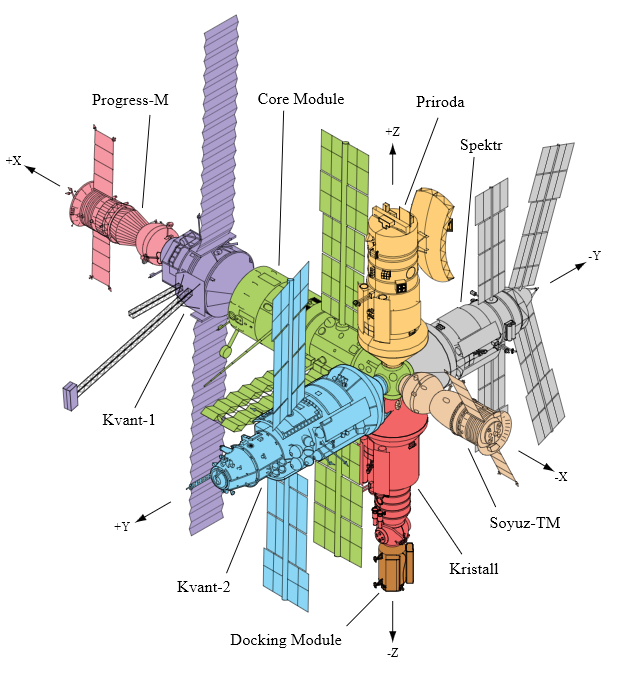

Mir Space Station
=================

The Mir Space Station (Russian: peace) was a direct continuation of the Salute program and a prototype for the ISS. Initially, it served only USSR cosmonauts and was made available as part of the Intercosmos program. After the collapse of the Soviet Union, flights by international crews were made possible. During more than 15 years of operation in orbit, it has hosted 28 permanent crews and many temporary visits by American Space Shuttles.

Its construction began with the transfer of resources provided by Progress-25 and Progress-26. The task was performed by the Soyuz T-15 crew (Leonid Kizim and Vladimir Soloviev). During the 50-day stay, the crew also visited the Salut-7 station in order to transport some of the equipment to Mir. At the moment, it is the only case in history that astronauts visited two stations during one flight.

    Diagram of the Mir Space Station. Source: Wikipedia
