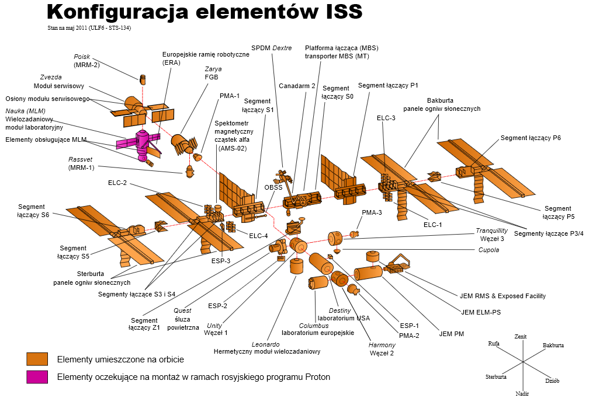

International space Station
===========================

The International Space Station program began with a combination of the concepts of the Freedom and Mir-2 (DOS-8) projects. It then evolved into the first international research platform called International Space Station. The program is jointly developed by the five largest space agencies: NASA, Roscosmos, JAXA, ESA, and CSA. Construction began with the placement of the Russian modules in 1998. The first crew arrived on November 2, 2000. Since then, the station has been permanently inhabited by 3 or 6-person crews (witch begun of private companies space flights, the station starting host even 12 people) as part of the so-called expedition. The subject of the ISS is detailed in the section on :ref:`preparation of crews for flights on board <Robotics and ISS systems>`.

At the moment, the most time-consuming part of the astronaut training process is preparing them for work on the International Space Station. However, it should be noted that the ISS is scheduled to be deorbiting in 2028.

    Schematic diagram of the ISS space station. Source: Wikipedia
