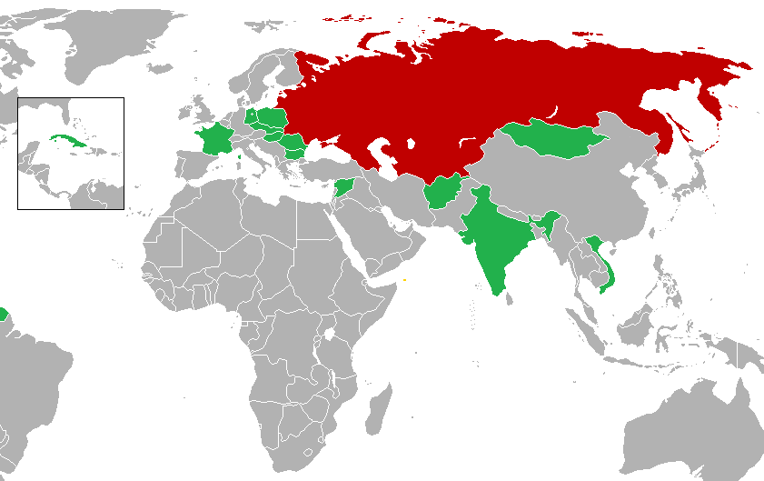

Interkosmos program
===================

During the congress of representatives of socialist countries in Moscow on April 5-13, 1967, a cooperation program in the field of space exploration - Intercosmos was adopted. The program included both unmanned and manned flights, which enabled cosmonauts from outside the USSR and the USA to fly into space. The main assumption of the cooperation was the use of ground infrastructure and Soviet missiles. International cooperation was to cover scientific research and manned flights. The legal side of the agreement and the actions of the member states were regulated by a document concluded on July 13, 1976, and which entered into force on March 25, 1977. Later, as part of the Interkosmos program, the Mir station was established

The main goal of the Interkosmos program was research in the areas of:

- space physics,
- meteorology,
- communications,
- biology,
- space medicine.

Under the Intercosmos program, cosmonauts were selected from the best pilots among the countries that had ratified the agreement. The first astronaut who was not a citizen of the USA and the USSR was the Czech Vladimír Remek, who flew on March 2, 1978. The second person was General Mirosław Hermaszewski (June 27, 1978). :numref:`table-selection-interkosmos` presents the list of Intercosmos cosmonauts.

.. csv-table:: The list of cosmonauts under the Intercosmos program. Source: Wikipedia
    :name: table-selection-interkosmos
    :file: data/selection-interkosmos.csv
    :widths: 16, 27, 27, 15, 15, 10
    :header-rows: 1

    Countries participating in the Interkosmos program. Source: Wikipedia
