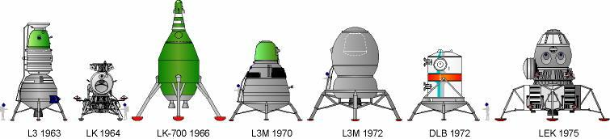

Moon program (N1-L3)
====================

The USSR competed with the United States in the space race. The culmination of the entire Space Race was to be a manned flight to the Moon. For this purpose, Chief Design Engineer Sergei Pavlovich Korolev (SP, Chief Design Engineer) started work on the N1 rocket. The program also includes an orbiting module (Russian: * LOK - Lunnyj Orbitalny Korabl *) and a lander (Russian: * LK - Lunnyj Korabl *) shown in the picture :numref:`figure-spacecraft-lk-models`.

In 1966, landing simulations began and cosmonauts were assigned to lunar training (:numref:`table-selection-n1-l3`). Groups were created whose goals were:

- Soyuz 7K-OK - qualification of Soyuz ships for orbital flights (lider Gagarin)
- L1/Zond - Lunar flights on a Proton rocket (lider Komarow),
- L3 - development of procedures and methodology for landing on the Moon (lider Leonow).

18 missions have been planned under the N1-L3 program. Due to his leadership of the landing development group, Leonov had the best chance of being nominated to be the first astronaut on the moon. :cite:`Leonov2006`.

Contrary to the American approach, the N1 rocket did not consist of three, but five * stages * and 30 first-tier engines. Due to the complexity of the system, the rocket exploded every time it took off. After the fourth unsuccessful launch of the N1 rocket, the geopolitical change and the loss of the space race, the Party's Central Committee decided to close the program.

.. csv-table:: List of cosmonauts assigned to training groups under the lunar program :cite:`Kamanin1999`
    :name: table-selection-n1-l3
    :file: data/selection-n1-l3.csv
    :header-rows: 1
    :widths: 10, 90

    Various prototypes of lunar landers as part of the USSR manned program. Source: Astronautics/Mark Wade :cite:`Wade2018`
