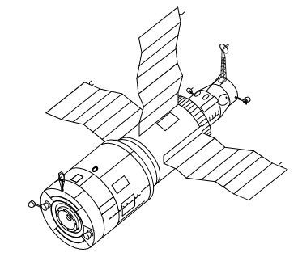

Salut program
=============

The first-ever program of an orbital space station was Salute. The station structure was single-module and launched into orbit on a Proton-carrier rocket. The cosmonauts, using Soyuz ships, docked to the station, where they conducted research on the effects of long-term microgravity on the human body. The program was also called the Long-Time Orbital Station (Russian: * DOS - Dolgermennaya Orbitalnaya Stancija *), and at the same time the military program * Almaz * (Russian * Diamond *) was being created.

The stations were equipped with a docking port, thanks to which both manned and unmanned Progress ships could join the station and provide it with fuel, oxygen and other resources.

.. csv-table:: Llist of space stations under the Salut / Ałmaz / Mir program. Source: Wikipedia
    :name: table-salyut-timeline
    :file: data/salyut-timeline.csv
    :header-rows: 1

    Diagram of the Salut-6 space station. Source: Wikipedia
