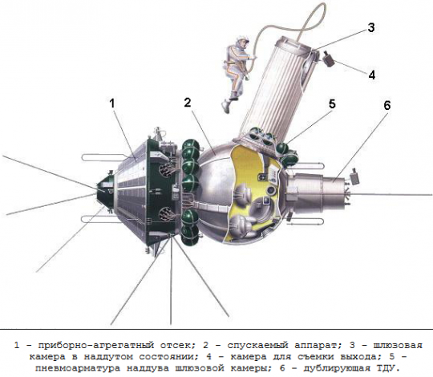

Woschod program
===============

The Woschod program continued the Wostok program. He introduced modifications to the capsule, increased its volume, and increased the number of crew members to three. An enlarged carrier rocket was also used. In 1964 and 1965, there were two flights under the program.

The greatest achievement during the Woschod program was the first human exit into open space, the so-called * EVA *. This was done by the Russian cosmonaut Alexei Leonov on March 18, 1965. The first ascent lasted 12 minutes and almost ended with the death of the cosmonaut. Due to the pressure difference, his suit swelled to a size that would not allow him to return to the airlock. Leonov depressurized the suit and deflated air, making it possible to re-enter the capsule.

.. csv-table:: Woschod program flight list :cite:`Siddiqi2000`
    :name: table-woshod-flights
    :file: data/woshod-flights.csv
    :header-rows: 1
    :widths: 10, 10, 10, 40, 30

    Scheme of the ship Woshod. Source: Wikipedia
