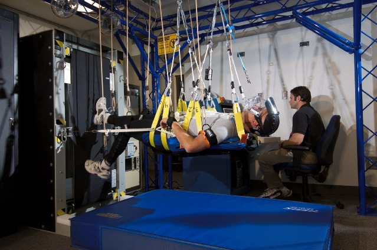

Exercise equipment
==================

Modern technologies are increasingly being used in gyms and laboratories where astronauts exercise. Among the innovative ideas, research is being carried out on the use of VR technology to stimulate the brain during exercise in order to accelerate the rehabilitation of astronauts returning from long flights. Exercise devices used during training and subsequent physiotherapy include:

- Human rhine wheels (right-left rotation),
- gyroscope (* MAT - Multi-Axial Trainer *) (rotation around three axes),
- looping (swing 360 ° with the possibility of rotation around the vertical axis of the exerciser),
- ergometer,
- * vertical treadmill *,
- a combination of VR systems and treadmills that change the inclination and yaw (* Adaptability Training System *),
- overpressure treadmill system (ALTER).

The Vertical Treadmill system, by changing the angle of the treadmill and the distance of the boom, has the ability to change the perceived load to simulate the gravity of the Moon and Mars :numref:`figure-infrastructure-gym-vertical-treadmill`.

    Astronaut while exercising on the Vertical Treadmill. Source: NASA
