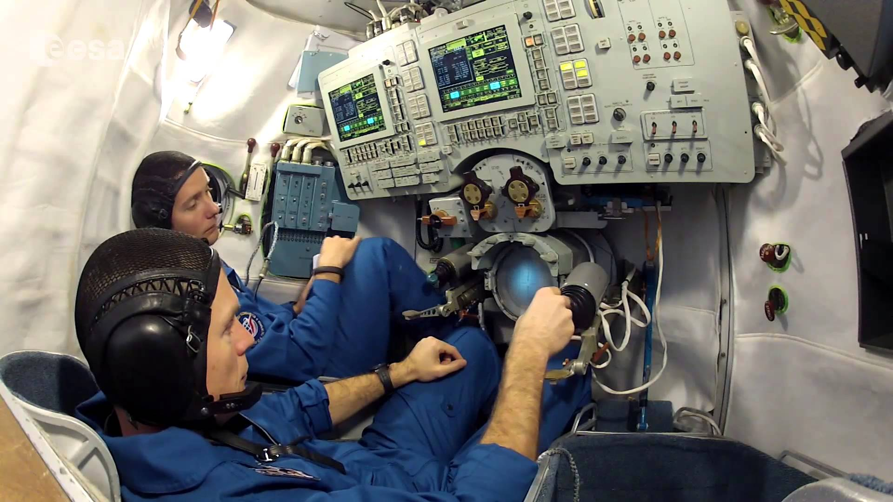

Flight simulators
=================

Flight simulators have been used in aviation for many years and have accompanied astronauts in their training from the beginning of the Space Race. In the simplest division, flight simulators are divided into stationary (Basic Instrument Training Device [BITD], Flight and Navigation Procedures Trainer [FNPT], Flight Training Device [FTD]) and mobile (* FFS - Full Flight Simulator *). :cite:`Kelly2017`. FFS simulators allow you to feel the twists and deviations. The most famous simulators include:

- LM lander simulator in the Apollo program,
- Shuttle Motion Simulator (SMS),
- Soyuz spacecraft simulator.

Flight simulators are used not only to train astronauts, but also to develop procedures and optimize the design of capsules and avionics. Astronauts collaborate with engineers developing new piloting techniques, ergonomics of use in flight and the arrangement of interface elements both in the cockpit and on the * MFD - Multi-functional Display *. The simulators of future spacecraft include:

- Federation/Eagle,
- Orion,
- Boeing CST-100 Starliner,
- SpaceX Crew Dragon.

    Astronauts Oleg Novitskiy (Roscosmos) and Thomas Pesquet (ESA) practice procedures in the Soyuz simulator at the Gagarin Cosmonaut Training Center in the Star City. Source: ESA
