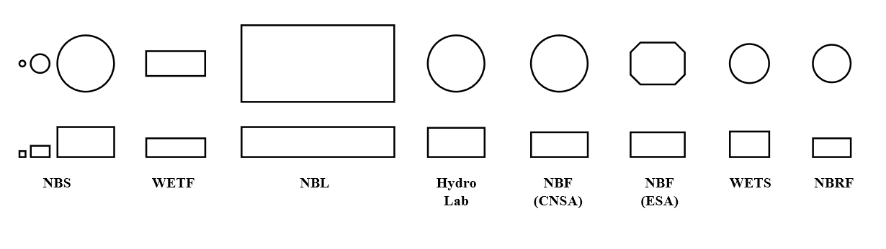
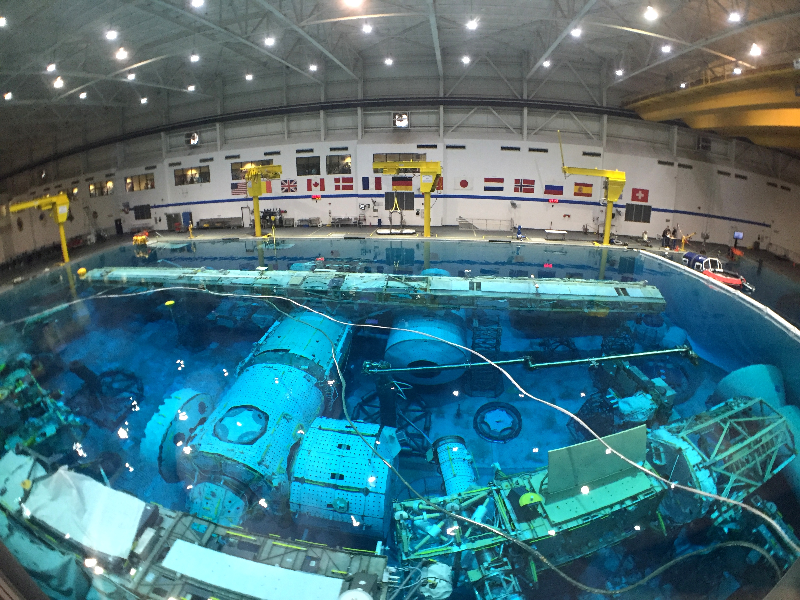
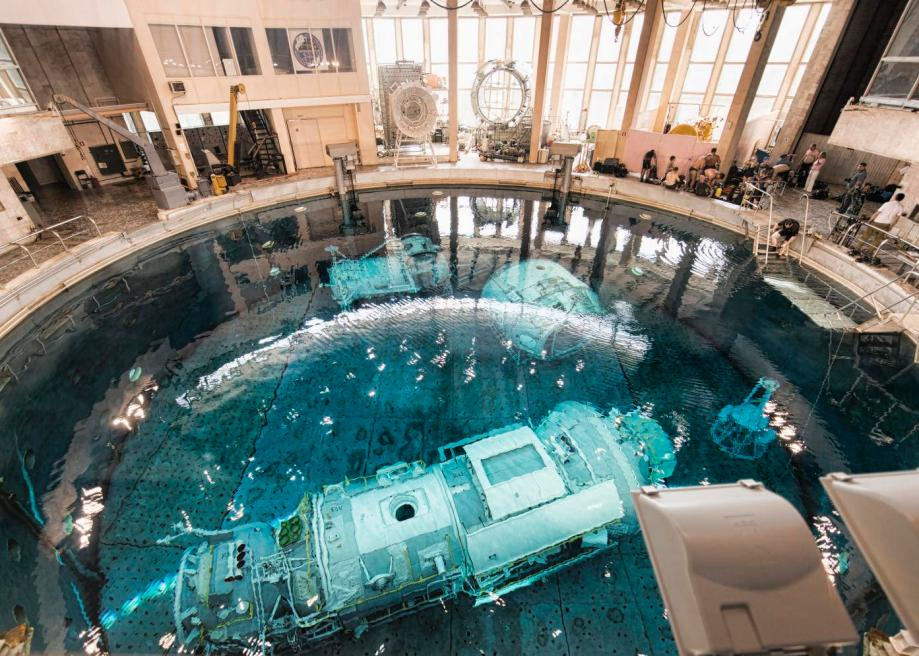
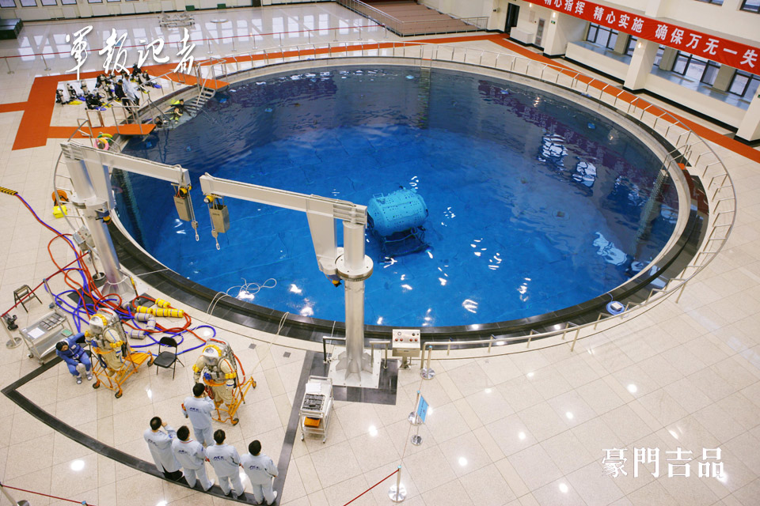
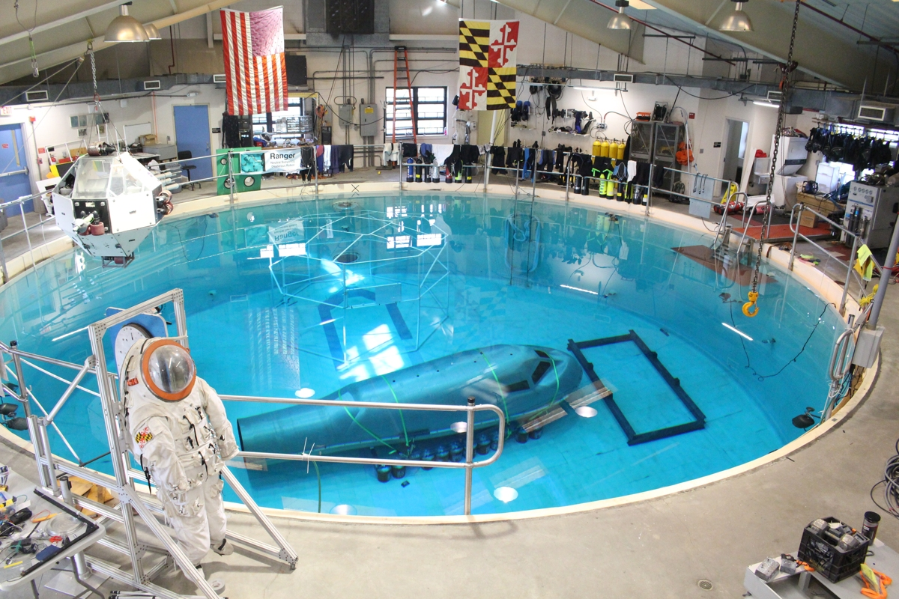

Neutral buoyancy pools
======================

Ever since the Gemini 12 mission preparation for flight, when american astronaut Buzz Aldrin first used diving techniques to simulate EVA, space agencies have started using Neutral Buoyancy centers to train astronauts.

In addition, neutral buoyancy pools are also used in spacecraft emergency abandonment training. An example of this type of device is the H.U.E.T. (Helicopter Underwater Egress Trainer) and M.E.T.S. (Modular Egress Training Simulator). Only the NBL laboratory belonging to NASA is equipped with this type of device. Astronauts from other agencies use infrastructure belonging to private companies to undergo training in sea rescue.

.. csv-table:: List of neutral buoyancy pools
    :name: table-infrastructure-neutral-buoyancy-pools
    :file: data/infrastructure-neutral-buoyancy-pools.csv
    :header-rows: 1

    Pcomparison of the scale and shapes of neutral buoyancy pools. Top row shows top view, bottom row shows side view Source: Wikipedia

NASA - Neutral Buoyancy Laboratory
----------------------------------
The largest neutral buoyancy training facility is NBL (Neutral Buoyancy Laboratory), located at the Sonny Carter Training Facility near Johnson Space Center in Houston, Texas. It is also the largest swimming pool in the world. At its bottom is the mock-up of the american segment of the International Space Station. During the basic training and subsequent specific training, astronauts prepare to carry out the most critical ISS maintenance tasks, i.e. servicing and replacing components outside the station and emergency procedures.

Currently, with the ISS fully operational in the NBL pool, a lot of simulations related to the preparation for the mission are taking place. The simulation calendar is 100% filled and training takes place in three eight-hour shifts a day. This leaves little margin for the development of plans and tests for technologies related to the future exploration of the Moon, Mars and asteroids. For this reason, astronauts from other agencies train at their centers as part of the "EVA pre-familiarization" and then travel to Houston for final training and certification in the use of the EMU suit.

    NBL- Neutral Buoyancy Pool located in Houston, TX, USA. Source: NASA/JSC

ESA - Neutral Buoyancy Facility
-------------------------------
The neutral buoyancy facility (NBF) is located at the EAC in Cologne. It is used by ESA astronauts for the so-called "EVA pre-familiarization", i.e. for familiarization training with space walk procedures. Due to the permanent occupancy of the NBL swimming pool in the United States and the lack of free training facilities, it was decided to build a center in Europe. The preparatory course aims to pre-train european astronauts for training and certification at the NBL facility in Houston.

The most important elements of NBF training are:

- EVA operational procedures,
- getting acquainted with the safety protocol of the station couplings/hooks,
- practice of transfers between modules,
- training in the use of specialized tools,
- development of communication skills with other crew members (IVA and EVA),
- ability to work in an environment of neutral buoyancy,
- training of emergency scenarios,
- maintaining situational awareness in a complex and changing environment.

The simulated EVA outputs are divided into the so-called training units. All units must be completed on each dive. Each dive takes approximately 5 hours. Currently, the standard practice is 5-7 times the training of each activity certified in NBL. The amount depends on the complexity of the training unit and the skill level of the trained astronaut.

Subsequent assignment to spacewalks on the ISS mission is based on EVA skill evaluation that is done early in training at the NBL facility in the US. Those astronauts who demonstrate the highest level of skill will be directed to additional training. Subsequent allocation is also dependent on demand and / or emergency situations.

In addition, the facility is also used as a test site for tools and procedures being developed for future lunar missions.

.. figure:: img/infrastructure-neutral-buoyancy-nbf.jpg
    :name: figure-infrastructure-neutral-buoyancy-nbf
    :width: 80%
    :align: center

    The NBF neutral buoyancy pool located at the European Astronaut Center in Cologne, Germany. Source: ESA/S. Corvaja

Roscosmos - Hydro Lab
---------------------
In order to be certified for the Russian Orlan suit, astronauts must complete a course at the Gagarin Cosmonaut Training Center in Star City. This resort features the Hydro Lab Pool, located in Building 30 and 32 :cite:`RoscosmosHydroLab`. The pool houses the real-size mock-up of the Russian part of the ISS. Cosmonauts practice moving between modules as well as operating the specific mechanism of Russian airlock.

    The Hydro Lab neutral buoyancy pool located at the CGagarin Cosmonaut Training Center in Star Town in Russia. Source: Roskosmos/CPK

CNSA - Neutral Buoyancy Facility
--------------------------------
The Chinese State Space Agency has opened a CNSA China Astronaut Research and Training Center at the Astronautical Center in Beijing, China. This center is also used to certify the use of Feitan suits. Currently, only Chinese astronauts train at this facility. This state of affairs may change as China has intensified collaboration with ESA and Roscosmos on the Moon Village concept and joint exploration of the Moon.

    BF neutral buoyancy tank at the Beijing Astronautical Center. Source: China Space Report

JAXA - Weightlessness Environment Test System
---------------------------------------------
The JAXA neutral buoyancy pool was located at the Tsukuba Space Center in Ibaraki, Japan. It has been closed since the strong earthquake in 2011. Japanese astronauts train mainly in the American NBL.

University of Maryland - Neutral Buoyancy Research Facility
-----------------------------------------------------------
The Neutral Buoyancy Research Center (NBRF) was built under a NASA grant in which the Massachusetts Institute of Technology (MIT) Space Systems Laboratory participated. Due to the lack of space on the campus, it was decided to build a swimming pool at the University of Maryland. There are no astronaut training courses at this center. The pool is actively used in research on future missions and a test of innovative EVA equipment.

    The NBRF neutral buoyancy pool located at the University of Maryland, USA. Source: Diamondback/Julia Reed
