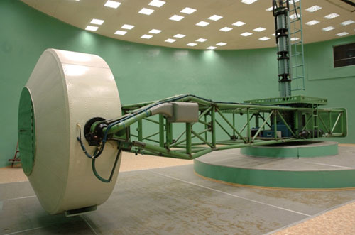
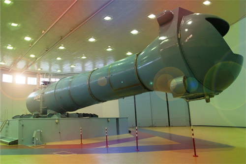
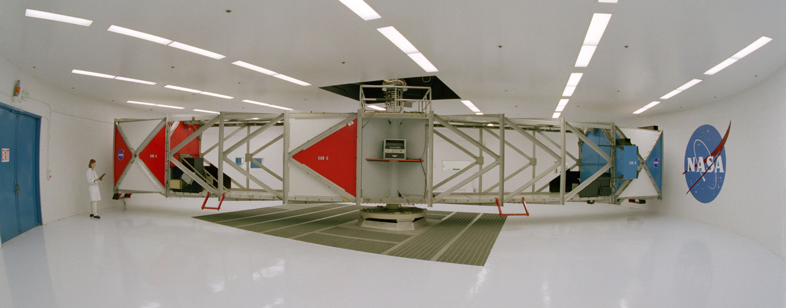

Overload centrifuges
====================

Overload centrifuges are devices capable of increasing the centrifugal force and the perceived gravity acceleration (* g-load *). With the appropriate design and the increase in speed, it is possible to adjust the speed of rotation and simulated overload. Thanks to centrifuges, it is possible to test and train the body's tolerance to overload. Depending on the direction of the acceleration vector, duration and intensity, the following effects appear:

- vision color loss (* gray-out *),
- tunnel vision *,
- loss of vision (* blackout *),
- loss of consciousness (* G-LOC - Gravity Induced Loss of Consciousness *),
- * redout * - the action of acceleration with a negative turn (* negative g *).

The increase of the gravitational acceleration factor is influenced by the rapid maneuvering of the vehicle, rocket launch, entry into the atmosphere, emergency flight trajectory in the atmosphere, the so-called ballistic curve and landing. The effectiveness of training in a centrifuge overload allows astronauts to tolerate accelerations 1.5-2 g greater than that of an untrained person. It should be mentioned that training requires renewal, because tolerance is "forgotten" by the body.

Compression overload pants are also used to improve tolerance. Pressure on the vessels slows down the flow of blood from the legs and less blood reaches the brain. The pressure is obtained statically (strong bond) or dynamically by inflating the chambers sewn into pants with air as the overload increases. Astronauts put on such clothes under the Sokol suit in preparation for returning to Earth :cite:`Peake2017`. In addition, the tolerance can be increased by using the AGSM (* Anti-G Straining Maneuver *). Proper breathing training allows trainee to increase the tolerance of overloads and maintain awareness for longer in the event of their occurrence.

The most important centrifuges used in manned space flights include:

- CF-7, Roscosmos,
- CF-18, Roscosmos,
- 20-G Centrifuge, NASA,
- Human Performance Centrifuge, NASA,
- Short Radius Centrifuge, NASA.

.. csv-table:: List of centrifuges used to prepare astronauts in manned flights
    :name: table-infrastructure-centrifuge-human
    :file: data/infrastructure-centrifuge-human.csv
    :header-rows: 1
    :widths: 10, 20, 20, 5, 5, 5, 5, 30

CPK - CF-7
----------
The CF-7 overload centrifuge was commissioned in 1973. Selected technical parameters are presented:numref:`table-infrastructure-centrifuge-human`. The scope of tests carried out in the device :cite:`CPKCentrifuge`:

- acceleration tolerance test during training and selection of pilots and astronauts,
- study of the impact of extreme space flight conditions on the human body,
- research on methods to improve overload tolerance and reduce negative effects,
- the ability to predict the impact of high overloads on the human body,
- creating a simulator of future space vehicles and airplanes,
- testing of aviation and space models.

    The CF-7 overload centrifuge located at the Gagarin Cosmonaut Training Center in Star City in Russia. Source: Roscosmos/CPK

CPK - CF-18
-----------
In 1980, a second overload centrifuge was opened at the Gagarin Cosmonaut Training Center, which enables the exchange of the cabin interior and the parameters inside the cabin, i.e. temperature, air composition, humidity and pressure. The CF-18 centrifuge has a higher acceleration gradient and a maximum speed of rotation giving a simulated overload of 30g :cite:`CPKCentrifuge`. Selected technical parameters are presented :numref:`table-infrastructure-centrifuge-human`.

    The CF-18 overload centrifuge located at the Gagarin Cosmonaut Training Center in Star City in Russia. Source: Roskosmos/CPK

NASA - Ames Research Center 20-G Centrifuge
-------------------------------------------
The American 20-G Centrifuge is located at the Ames Research Center, Moffett Field, CA in the USA is shown at :numref:`figure-infrastructure-centrifuge-20g`. The device is used to train flying personnel of the Air Force, US Navy and NASA astronauts :cite:`NASACentrifuge`. Selected technical parameters are presented :numref:`table-infrastructure-centrifuge-human`. Independently before flying on the Soyuz, NASA and ESA astronauts undergo training in Russian centrifuges CF-7 i CF-18.

    20g overload centrifuge located at the Ames Research Center, Moffett Field, CA, USA. Source: NASA/Ames

Overload centrifuges for human research
---------------------------------------
There are many facilities for research on the impact of high overloads on the human body. Some of them are not directly used in the process of training astronauts, but can participate in experiments carried out on their bodies. The most important centers include:

- Short Radius Centrifuge, University of Texas Medical Branch, Galveston, TX, USA,
- Short Arm Human Centrifuge, DLR, Germany,
- Dynamic Flight Simulator, Flight Physiological Center, Sweden,
- Centrifuge overload - training simulator, WIML, Poland.

Poland has one of the most modern overload centrifuges certified for human testing and overload training. This centrifuge is located in the center of the Military Institute of Aviation Medicine in Warsaw. This infrastructure is unique in the world, as it is one of the three that can simulate overloads in the Gx + and Gx- axes.

Overload centrifuges for scientific research
--------------------------------------------
Selected overload centrifuges can be included in scientific research using increased gravitational acceleration and centrifugal force, but not certified for use in human studies:

- Large Diameter Centrifuge, ESA ESTEC, Noordwijk, The Netherlands,
- 8-Foot Diameter Centrifuge, NASA Ames Research Center, CA, USA,
- 2-Meter Diameter Centrifuge, NASA Ames Research Center, CA, USA,
- 24-Foot Diameter Centrifuge, NASA Ames Research Center, CA, USA.
