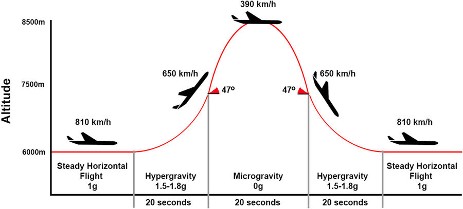

Parabolic flights
=================

In order to familiarize astronauts with the influence of microgravity on the human body and the specific behavior during free fall, space agencies began to use airplanes in parabolic flights. Depending on the parameters of the parabola, you can get:

- microgravity 0g,
- gravity on the surface of the moon (16.6% of Earth's force of gravity),
- gravity on the surface of Mars (40% of Earth's force of gravity).

:numref:`table-infrastructure-parabolic` presents a list of planes used by space agencies and private companies for parabolic flights.

    Parabolic flight profile while simulating the state of microgravity. Source: Nature

.. csv-table:: List of airplanes used for parabolic flights
    :name: table-infrastructure-parabolic
    :file: data/infrastructure-parabolic.csv
    :header-rows: 1
