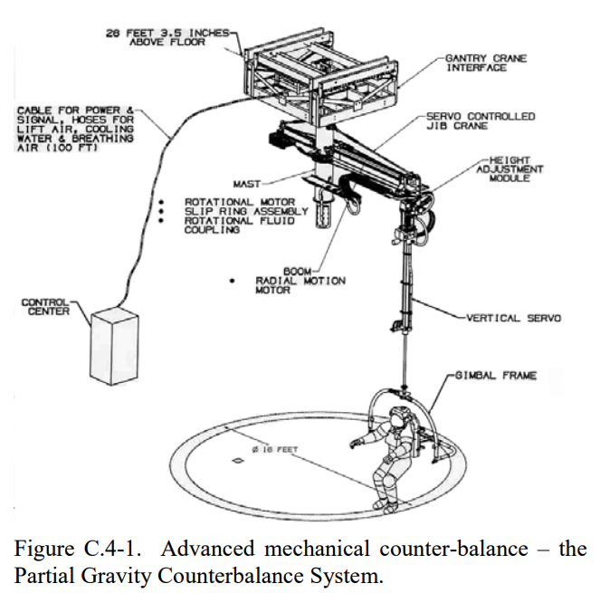

Suspended systems simulating the environment of reduced gravity
===============================================================

A suspended system was used in the training programs to prepare astronauts in a limited range of motion and with a changing perspective of the view. In addition, this solution allows you to simulate the gravity prevailing on the Moon, Mars and other celestial bodies by relieving the astronaut and using ropes of appropriate elasticity.

    Suspended system used for astronaut training at the Gagarin Cosmonaut Training Center in Star City, Russia. Source: NASA/JSC

.. todo:: Rys. 3.15. Suspended system - "Partial Gravity Counterbalance System" used for astronaut training at the Gagarin Cosmonaut Training Center in Star City, Russia. Source: NASA/JSC
