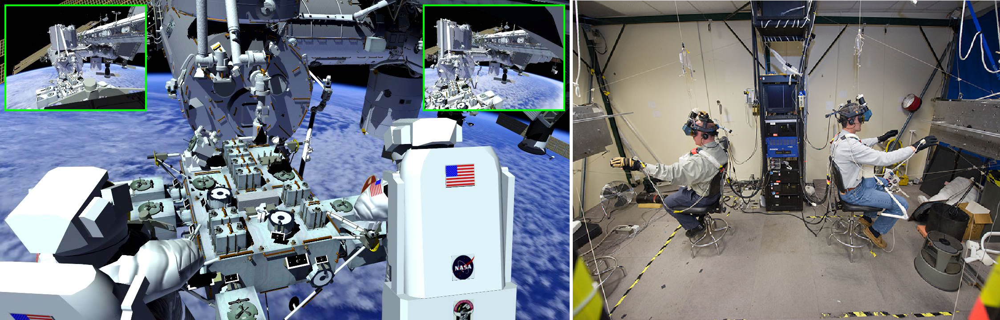

Virtual Reality Laboratories
============================

* Virtual Reality *  and * AR Augmented Reality * laboratories allow you to train complex activities and procedures without endangering the lives of astronauts and the need for expensive infrastructure. In addition, astronauts are trained to use haptic technologies such as * Force Feedback * and * HMI - Human-Machine Interaction * skills. The most important VR laboratories include:

- Virtual Reality Laboratory (VRL), NASA,
- Haptics Laboratory, ESA.

Virtual Reality Laboratory (VRL), NASA
--------------------------------------
VRL is equipped with simulators and devices that allow to recreate the external part of the station. Thanks to VR glasses, the astronaut has the opportunity to look around in the environment and train situational awareness during EVA. The gloves and the system that he wears during training allow for * kinesthetic sensation *, which is a simulated sense of inertia of objects. The gloves can reproduce the feeling up to 226.8 kg (500 lbs). In the VRL laboratory, astronauts are trained in EVA procedures and systems, i.e .:

- operation of the S.A.F.E.R. rescue system,
- controlling the SSRMS Canadarm2 manipulator,
- distribution of external elements of ISS stations,
- location skills in relation to station elements,
- transfer between station modules.

    Astronauts training EVA in the VRLab laboratory. Source: NASA/JSC

Haptics Lab ESA
---------------
The European Space Agency's Haptics Laboratory is located at the ESTEC European Space Research and Technology Centre in the Netherlands. The laboratory enables testing of robotic systems and the HMI. The X-Arm-II exoskeleton was developed in the laboratory (Fig. 3.11.). In addition, ESA astronauts practice their rover steering skills using controllers from Force Feedback.

.. figure:: img/infrastructure-vr-exoskeleton.jpg
    :name: figure-infrastructure-vr-exoskeleton
    :width: 80%
    :align: center

    The X-Arm-II exoskeleton is used to simulate the sensation of controlling machines. Source: ESA
