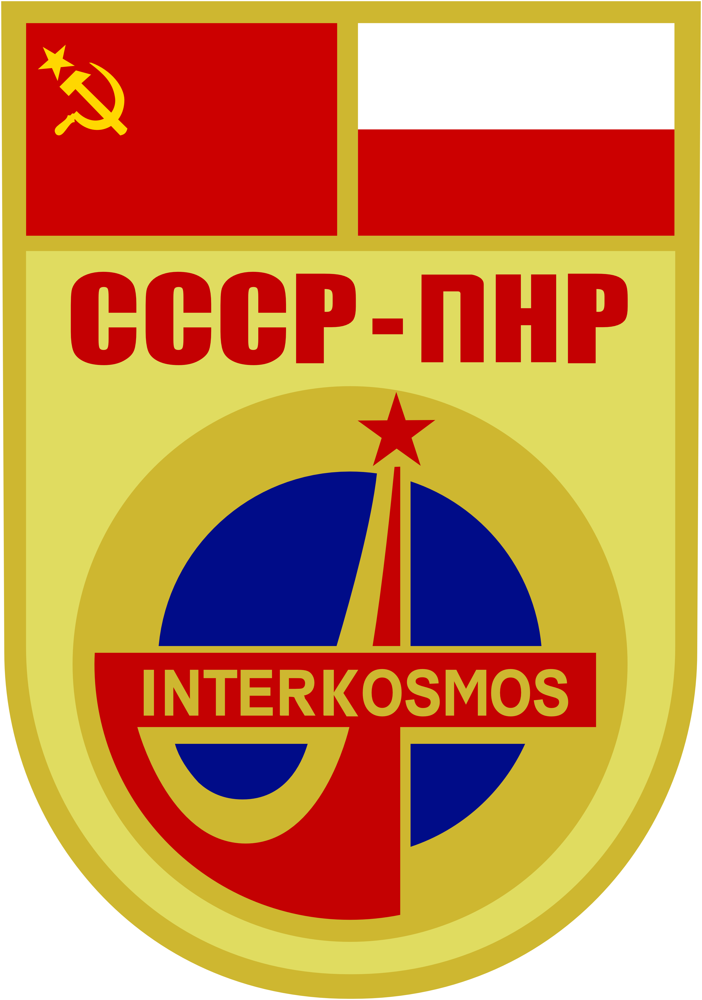
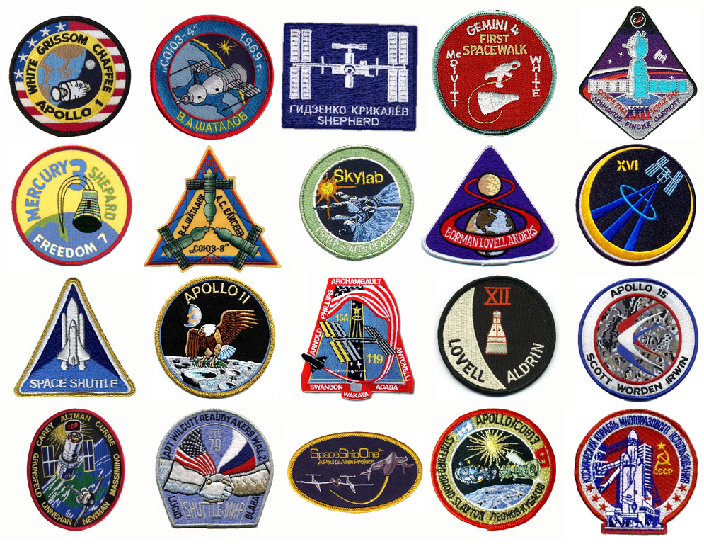

**********************************************************
Mission, procedures and traditions before and after launch
**********************************************************

Traditions before launch
========================
.. todo::
    - Astronauts equip MAG with sanitary napkins so that they do not leak while waiting for the start (training at Cottage House No. 3 in Star City) :cite:`Anderson2015`
    - Astronauts in the days of Shuttle took a bag of clothes with them, depending on where they will land, e.g. shorts to use in California etc.  :cite:`Anderson2015`, :cite:`Melvin2017`
    - They have been eating steak with fried eggs since the days of Sheppard :cite:`Wolfe1979`, :cite:`French2007`

Traditions before the departure of the Soyuz crew's from the Baikonur Cosmodrome
--------------------------------------------------------------------------------
In order to commemorate historical events, astronauts take part in many traditions before flying into space. Each of the events is monitored by the media from around the world. The list of activities performed by future participants in space flights is presented below.

Before going to the Baikonur spaceport:

- a visit to the Red Square in Moscow,
- laying flowers near the Kremlin wall on the graves of fallen cosmonauts.

Immediately after arriving in Baikonur:

- raising the national flags of astronauts,
- planting a tree in the Avenue of cosmonauts.

A few days before departure :cite:`Kelly2017`, :cite:`Hermaszewski2013`:

- blessing the rocket by the pop,
- astronauts cannot see the rocket after the second or third pre-flight inspection,
- quarantine and protection against microbes,
- sleeping on the bed with the head down.

Right before launch :cite:`Kelly2017`:

- the last haircut by a hairdresser,
- the last meal of the crew,
- signature on the door of the room in which you lived,
- entry in the commemorative book in Gagarin's office,
- watching the movie "The White Sun of the Desert",
- making a last will document before departure,
- astronauts are turned up and down several times before take-off to get used to cosmic motion sickness,
- re-checking the tightness of the suit in the bus during the way to the spaceport,
- farewell to families,
- bus transfer to building 254 to put on the Sokol suit,
- urinating next to the bus - commemorating Gagarin's deed (women prepare filled bottles in advance and then spill them),
- the last salute standing in designated places,
- posing for photos and waving to observers from the stairs to the Soyuz rocket,
- checking systems,
- each astronaut can choose three songs that are played while waiting for the start :cite:`Hermaszewski2013`.

Traditions before the departure of the Space Shuttle crews
----------------------------------------------------------
American traditions before departure are more modest than their Russian counterparts. Usually they are limited to :cite:`Hitt2014`:

- barbecue the day before departure,
- traditional joint last meal of the crew,
- poker games in which the astronauts play until the commander loses, which symbolizes the use of all "bad luck" for the duration of the mission.

For the last meal before the flight, many American astronauts, like Alan Shepard (the first American in space), traditionally choose steak with scrambled eggs :cite:`Madrigal2013` and orange juice.

Astronaut Close Family Escort
-----------------------------
.. todo:: Family Escort, two astronauts currently not training for missions. One is responsible for the immediate family, the other for the extended family and friends at the start. The one from the family helps you later in your absence. From counting friends on the bus, arranging museum tickets, and hearing complaints about being too cold to heat in a hotel, to helping them set up savings accounts for children's college, organizing a funeral, and being an advocate for the family on an accident investigation board. It helps to understand what the start and mission looks like from the eyes of the family.

Mission insignia
--------------
According to the tradition started with the first manned flights, teams going into space design their "mission patch" (mission badges). The most common format for the mission logo is a circle with the astronauts' names in the border. The exception to the rule of naming names is the Apollo 11 mission, during which, due to the international nature of the first moon landing, this tradition was abandoned (the Apollo 11 mission was to be a "for all mankind" mission).

To create the mission insignia, the crew commander assigns a few people who work with the graphic designer, and this is one of the first things crews do after being assigned to a mission. Some crews use professional companies that design and manufacture mission insignia :cite:`Anderson2015`, :cite:`Spain2014`.

    IInsignia of the Soyuz-30 mission under the Intercosmos program. Gen. Hermaszewski and Gen. Klimuk took part in the mission. Source: Wikipedia

    The image shows selected mission insignia. Source: Wikipedia

Medical examinations before departure
------------------------------
Immediately before the departure, after the quarantine process, the medical examinations of the crews of the American space shuttle were just a formality :cite:`Anderson2015`. In the case of take-offs from the Baikonur cosmodrome, the crew undergoes thorough pre-take-off tests and the process of lying down with the head down to accustom the astronaut's body to a state of weightlessness :cite:`Hermaszewski2013`.

Preparing to return to Earth
=============================

.. todo::
    - "Agreement on the Rescue of Astronauts, the Return of Astronauts and the Return of Objects Launched into Outer Space"
    - http://www.unoosa.org/oosa/en/ourwork/spacelaw/treaties/introrescueagreement.html

.. todo::
    - Astronauts are getting 5-7 cm longer and have problems fitting in their Custom made seats in Soyuz
    - Space Shuttle exposing wheels to warm up

Preparation of the ship and crew
-----------------------------
- Prepare to return to Earth
- Transfer of command of ISS
- Soyuz or Dragon packing (Only cosmonauts are allowed to pack Soyuz before reentry.)

Return flight
-------------
- Undocking
- Orbit lowering
- De-orbit burn
- Entering the atmosphere and landing by ship

    - Normal entry into the atmosphere
    - Entering the atmosphere by the ballistic curve

24 immediate action buttons. Cover with flip lids, to prevent accidental pushes:
switch main engine off
Turn the backup thrusters
To keep the solar panels facing the sun, the Soyuz spins like a chicken on a spit

Landing and post-landing procedures
-----------------------------------
Dropping remaining fuel before impact on landing
- "Soft" landing system
- Landing on water
- Landing on land
- Landing in terrain not intended for that
- Search and rescue forces
- Removal of hydrazine impurities from the Space Shuttle

Operational procedures after returning to Earth
===============================================

Traditions after landing on Earth
---------------------------------
A press conference
After exiting the helicopter, sign the door
A local VIP handing out purple robe and a black hat and two guitars teasing like a ukulele. Women in national costumes give salt, bread and water.

Medical examination - eyesight, motor and circulatory systems
------------------------------------------------
IV administration after landing. Everyone has their MI-8 with a nurse, bed, doctor and support person

.. todo::
    - In space, the immune system is significantly weakened and much more susceptible to infections
     - The bone system weakened by the microgravity environment must withstand a large overload at reentry and then on the ground for the next few days
     - the heart has to adapt to pumping blood under gravity
     - Increased heart rate
     - Feeling weak in the legs like running a marathon
     - Get stretched every day
     - The muscles become shorter, especially the ones from walking, and begin to pull on joints that they would not normally pull

Physical fitness test
---------------------
.. todo:: Dexterity test - construction of base elements
     Evaluation with inserting "pegs" into the board. Evaluated speed and accuracy

     Computer simulation today you had to keep the cursor in a circle that runs on the screen, and on the second screen at the same time write the numbers that appear.
    Motion simulator (small cockpit on tilting platform):
    NASA T-38
    Driving race car on mountain range
    Mars rover on boulder field

    Aptitude test of using robotic arm in 3D (visualization in 3D)
    Calling medical clinic in order to get information about behavior of applicants.

Return
------
.. todo:: NASA G3, plane for 10 people with two beds in rear.

Post-flight briefing and evaluation of the astronaut
----------------------------------------------------
After arrival, there is a * mission review *. During this meeting, astronauts and those involved, i.e. flight controllers, summarize the events of the expedition. The main purpose of * debriefing * after a mission is to create a set of * Flight Rules *. It is a list of problems with solutions based on the events that happened during the mission and the actions taken by the crew. Each of the events is meticulously discussed and the results are grouped into the above-mentioned document, which contains a very detailed description. Review meetings last one day for each system, and such cycles can last for months :cite:`Hadfield2013`. Among the discussed components are, among others:

- communication systems,
- biological experiments,
- spacesuits,
- food (was there the right amount, did it taste good, how did the packaging work).

The meeting takes place with the astronauts who took part in the mission and with people responsible for individual subsystems. The deliberations are discussions. Older people sit at the table and less experienced astronauts by the wall :cite:`Hadfield2013`.

Next, the management staff performs post-flight evaluation on the basis of which decisions are later made regarding subsequent assignments.
