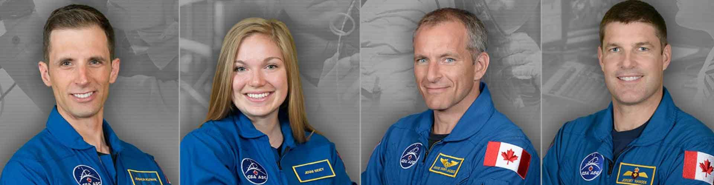

CSA - Canadian Space Agency
---------------------------
One of the most open-minded space agencies when it comes to selecting astronauts is the Canadian Space Agency. The candidate selection process is transparent and well documented on the agency's website. Among the tasks that the candidates have to face are :cite:`CSAAstronautsFAQ` :cite:`CSAAstronautSelection`:

- fire fighting,
- repair of a leaking container immersed in ice-cold water,
- evaluation of the exit from the sinking helicopter cabin,
- fitness evaluation of candidates in the gym,
- fitness evaluation in the swimming pool.

Particularly noteworthy is the task during which the persons participating in the process were divided into teams. One person from the team was in a dark room with a complete lack of visibility and had to assemble a model plane from Lego bricks. During the exercise, she could only communicate using a radio (walkie-talkie) with her companion who was in an illuminated room. The second person had instructions and a description of how to assemble the model.

During the above task, the commission took into account working under time pressure, communication efficiency, brevity of speech and the ability to provide the necessary data as well as the visualization of the problem.

The entire recruitment process is well documented and featured on the Canadian Space Agency's official * YouTube * channel :cite:`CSAAstronautSelectionVideo`.

    Canadian astronauts (from left to right): Joshua Kutryk, Jennifer Sidey, David Saint-Jacques, Jeremy Hansen. Source: CSA
