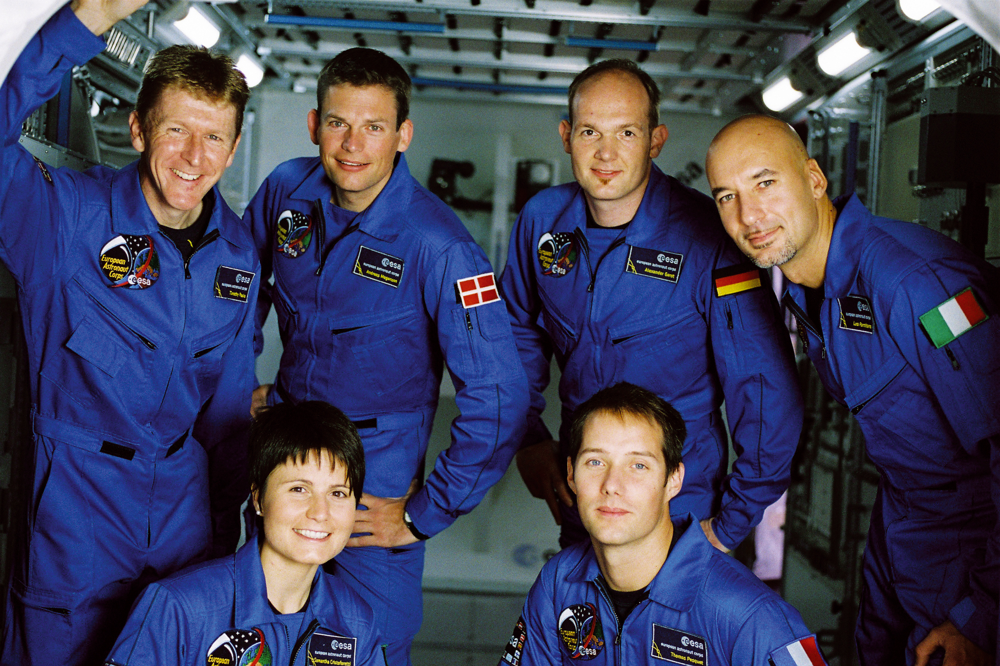

ESA - European Space Agency
---------------------------
One of the conditions to apply for the position of an ESA astronaut is nationality. Applicants must be a * ESA Member State * citizen of that agency. one of lasts recruitment process for the European Space Agency began in May 2008 and ended a year later in 2009. The selection was carried out by the EAC (* European Astronaut Center *) unit in Cologne, Germany. 8413 candidates took part in it. On May 20, 2009, six new astronaut candidates were presented at a press conference at ESA's headquarters in Paris. Candidates began their initial training on September 1, 2009. The following candidates were selected in this selection:cite:`How-to-Become-an-ESA-Astronaut`, :cite:`International-Astronauts`:

    Six new European Astronaut Corps recruits at the European Astronaut Center in 2009. Timothy Peake, Andreas Mogensen, Alexander Gerst, Luca Parmitano, Samantha Cristoforetti, Thomas Pesquet. Source: ESA–M. Koell :cite:`European-Astronaut-Corps`
