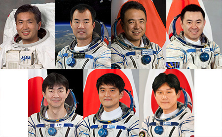

JAXA - Japan Aerospace Exploration Agency
-----------------------------------------
For more than 20 years after the flight of Mamoru Mohri, the first Japanese to fly into space aboard the American Space Shuttle in 1992, the Japanese JAXA agency has not recruited any more astronauts. Since the construction of the * Tsukuba Space Center *, there has been a change in the Agency's policy, which has decided to conduct further recruitments and expand the team of astronauts.

During one of the selections, the candidates were closely observed, witch monitoring their behavior also outside the official time. It was taken into account how they behave in a restaurant, whether they leave food on the plate or clean up after themselves, and how they behave under pressure. One of the recruiting tasks was to assemble 1,000 origami swans within a specified time frame. The recruitment committee monitored the diligence of bends, the candidate's overlap with the repeated task, the quality of workmanship and the performance under the pressure of passing time.

At the moment, no further plans to recruit more JAXA astronauts are known.

    Chiaki Mukai, Koichi Wakata, Takao Doi, Soichi Noguchi, Akihiko Hoshide, Naoko Yamazaki, and Satoshi Furukawa Source: JAXA
